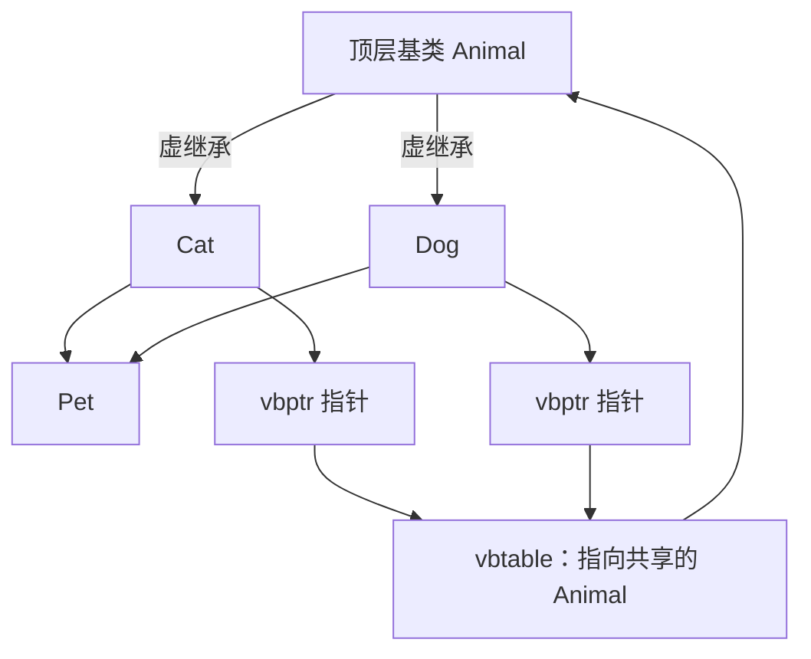
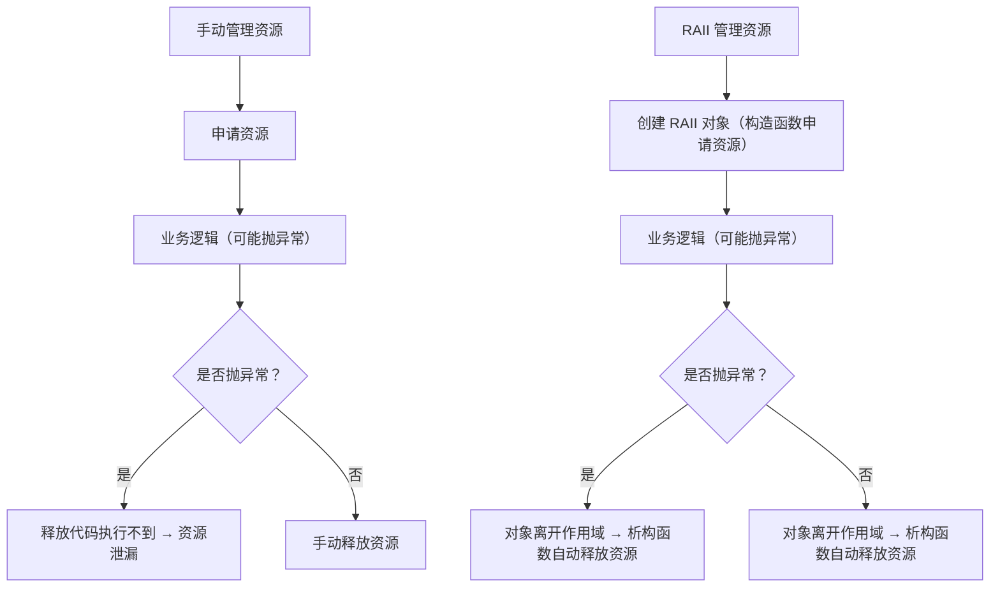

# 现代工程化C++基础

## 引用(reference)

### 左值和右值

**简单来说，左值是能放在赋值号左边的量，右值是只能放在赋值号右边的量**

具体来说：

- 左值：**有明确的内存地址、可以被取地址（&）、生命周期较长**（比如变量、数组元素、返回左值引用的函数结果）；
- 右值：**没有明确的内存地址、不能被取地址、生命周期短暂**（比如字面量、表达式结果、返回非引用的函数结果）。

**可以取地址的量为左值，反之则为右值**

### 引用的概念

引用就是某一变量（目标）的一个别名，也就是说，它是某个已存在变量的另一个名字，对引用的操作与变量名直接操作完全一样

### 引用的初始化

**类型标识符 &引用名 = 目标变量名**

上述格式中，“&”并不是取地址符，而是起标识作用，标识所定义的标识符是一个引用。引用声明完成后就相当于目标变量有两个名称。

### 定义引用注意事项

- 引用在定义时必须初始化
- 引用在初始化时只能绑定左值不能绑定常量值
- 引用一旦初始化，其值就不能再修改，也不能再作别的变量的引用
- 数组不能定义引用，因为数组是一组数据，无法定义其别名

### 引用和指针的区别

主要的不同点为：

- 不存在空的引用，引用必须连接到一块合法的内存
- 一旦引用被初始化为一个对象。就不能在指向另一个对象。指针可以在任何时候指向另一个对象
- 引用必须在创建时被初始化。指针可以在任何时间被初始化

### 左值和右值引用

**左值引用：** **T&（绑定左值的别名）**

- **只能绑定左值**（有地址，可取值，生命周期长的量）
- 不能绑定右值（临时值，表达式结果等），除非加`const`

`const`左值引用（const T&）：

`const` 修饰的左值引用也被称作“万能引用”

- `const`保证引用不会修改目标值，此时编译器允许右值的生命周期延长至与引用相同

左值引用的典型使用场景是**作为 函数参数传递 和 函数返回值**，可以避免拷贝对象，优化时空

**右值引用：T&&（绑定右值的别名）**

C++11引入右值引用，核心目的是**利用右值的临时性，实现移动语义（避免拷贝）**

- **只能绑定右值**
- 绑定后，引用成为右值的别名，可通过引用操作右值（甚至修改，因为右值本身是临时的，修改不影响其他变量）
- 不能直接绑定左值，除非通过`std::move`强制转换

关于`std::move`的作用

`std::move`是C++11标准库函数(头文件<utility>)，核心功能：

- 将左值强制转换为右值引用，本身不移动任何数据
- 转换后，原左值的生命周期并未结束，颁布建议再使用原左值(因为它可能被后续代码"移动"资源)

**右值引用核心使用场景：移动语义**

右值引用的最核心价值是实现“移动构造”和“移动赋值运算符”，避免不必要的拷贝

原理：

- 右值（如临时对象）的生命周期很短，其内部资源即将被销毁
- 通过右值引用，我们可以“偷”走右值的资源，而不是拷贝一份，从而提升性能

### 引用折叠

C++11 引入右值引用后，出现了 “模板参数 + 引用” 的复杂场景（如`template<typename T> void func(T&& param)`），此时会触发**引用折叠**—— 这是完美转发的底层基础，也是理解 “万能引用” 的关键。

**引用折叠的核心规则**

当一个表达式同时包含左值引用（`T&`）和右值引用（`T&&`）时，最终会折叠为**左值引用**，只有 “纯右值引用组合” 才会折叠为右值引用。

```c++
// 模板函数：T&& 是万能引用（触发引用折叠）
template<typename T>
void func(T&& param) {
    // 用 is_lvalue_reference 判断参数类型
    cout << "param 是左值引用？" << is_lvalue_reference_v<T&&> << endl;
    cout << "param 是右值引用？" << is_rvalue_reference_v<T&&> << endl;
    cout << "------------------------" << endl;
}
```

关键结论：

- 万能引用（`T&&`）的本质是 “依赖模板推导 + 引用折叠”，实现 “绑定所有值” 的能力；
- 普通右值引用（如`int&&`）不涉及模板推导，不会触发折叠，只能绑定右值。

### 完美转发

完美转发是引用折叠的核心用途 —— 它能让函数将参数 “原样转发” 给其他函数，既保留参数的**值类别（左值 / 右值）**，又保留**const 属性**，避免不必要的拷贝或移动。

没有完美转发时，转发参数会丢失值类别信息：

```c++
// 普通转发函数（不完美）
template<typename T>
void forward_func(T param) {
    target_func(param);  // param 是左值（无论传入什么）
}

int main() {
    int a = 10;
    forward_func(a);     // 传入左值 → target_func 接收左值引用（正确）
    forward_func(20);    // 传入右值 → 但 param 是左值 → target_func 接收左值引用（错误）
    return 0;
}
```

传入右值时，`forward_func`的参数`param`是局部变量（左值），导致`target_func`调用了左值引用版本，违背 “原样转发” 的需求。

**完美转发的实现：`std::forward`**

`std::forward`是 C++11 提供的完美转发工具（头文件`<utility>`），它能根据参数的原始值类别，“恢复” 其左值 / 右值属性，配合万能引用和引用折叠实现完美转发。

语法：`std::forward<T>(param)`，核心逻辑：

- 当`T`是左值引用类型时，`forward`返回左值引用；
- 当`T`是非引用类型时，`forward`返回右值引用。

在完美转发中，也能通过`std::decltype` 获取 ref 的精确类型（左值引用 / 右值引用）

```c++
void target(int& x) { cout << "接收左值：" << x << endl; }
void target(int&& x) { cout << "接收右值：" << x << endl; }

int main() {
    int a = 10;
    auto&& ref1 = a;          // 绑定左值 → 左值引用
    target(forward<decltype(ref1)>(ref1));  // 转发为左值 → 调用 target(int&)
    auto&& ref2 = 20;         // 绑定右值 → 右值引用
    target(forward<decltype(ref2)>(ref2));  // 转发为右值 → 调用 target(int&&)
    
    return 0;
}
```

修复后的代码：

```c++
// 完美转发函数
template<typename T>
void perfect_forward(T&& param) {  // 万能引用 (原理：模板推导 + 引用折叠 同auto&&)
    target_func(std::forward<T>(param));  // 完美转发
}

int main() {
    int a = 10;
    perfect_forward(a);     // 传入左值 → 转发为左值 → 调用左值引用版本
    perfect_forward(20);    // 传入右值 → 转发为右值 → 调用右值引用版本
    perfect_forward(move(a));// 传入将亡值 → 转发为右值 → 调用右值引用版本
    
    const int b = 30;
    perfect_forward(b);     // 传入 const 左值 → 转发为 const 左值
    return 0;
}

```

**完美转发的核心价值**

- 避免函数重载冗余：比如工厂函数、包装函数，无需为左值 / 右值分别写重载；
- 保证移动语义不失效：转发右值时仍能触发移动构造 / 赋值，而非拷贝；
- 保留 `const` 属性：`const` 左值会被原样转发，不会丢失 `const` 限定。

## 虚函数（Virtual）和 多态（polymorphic）

**在C++中， virtual 和 override 关键字用于支持多态，尤其是在涉及类继承和方法重写的情况下。正**
**确地理解和使用这两个关键字对于编写可维护和易于理解的面向对象代码至关重要。**

虚函数是用 `virtual` 关键字修饰的成员函数，核心作用是**允许子类重写（override）**，并支持**运行时动态绑定**（而非编译时静态绑定）。

- 普通函数：编译时就确定调用哪个函数（静态绑定）；
- 虚函数：运行时才确定调用哪个函数（动态绑定），这是多态的核心。

###  `virtual` 关键字

- 使用场景：在基类中声明虚函数。

- 目的：允许派生类重写该函数，实现多态。

- 行为：当通过基类的指针或引用调用一个虚函数时，调用的是对象实际类型的函数版本。

```c++
class Base 
{
    public:
    virtual void func() {
    std::cout << "Function in Base" << std::endl;
	}
};
```

类似于`virtual void speak() = 0` 是纯虚函数，它：

- 没有函数体，强制子类必须重写；
- 包含纯虚函数的类是 “**抽象类**”，无法实例化（只能作为父类被继承）；
- 抽象类的核心作用是定义 “接口规范”，比如所有 `Animal` 都必须能 `speak()`

### `override` 关键字

- 使用场景：在派生类中重写虚函数。
- 目的：明确指示函数意图重写基类的虚函数。

- 行为：确保派生类的函数确实重写了基类中的一个虚函数。如果没有匹配的虚函数，编译器会报
  错。

```c++
class Derived : public Base 
{
    public:
    void func() override {
    std::cout << "Function in Derived" << std::endl;
    }
};
```

**注意点**

**只在派生类中使用 override：** 

override 应仅用于派生类中重写基类的虚函数。

**虚析构函数：**

如果类中有虚函数，**通常应该将析构函数也声明为虚的**，否则其派生类的析构函数可能不会被调用，导致内存泄漏

父类析构函数不是虚函数时，用父类指针删除子类对象会导致内存泄漏（此时只会调用父类的析构函数）

具体解释如下：

```c++
// why using virtual destructor in base class?
// If a base class destructor is not declared as virtual,
// the derived class's destructor will not be called when
// an object is deleted through a base class pointer.
// This can lead to resource leaks if the derived class allocates
// resources that need to be released in its destructor.    
// Declaring the base class destructor as virtual ensures that
// the derived class's destructor is called first, followed by
// the base class destructor, allowing for proper cleanup of resources.
```

默认情况下，成员函数不是虚的，在C++中，成员函数默认不是虚函数。只有显式地使用 virtual关键字才会成为虚函数。
继承中的虚函数，一旦在基类中声明为虚函数，**该函数在所有派生类中自动成为虚函数**，无论是否使用 virtual 关键字。
正确使用 virtual 和 override 关键字有助于清晰地表达程序员的意图，并利用编译器检查来避免常
见的错误，如签名不匹配导致的非预期的函数重写。

### 虚函数表

C++ 的**运行时多态**本质是通过**虚函数表（vtable）** 和**虚函数指针（vptr）** 实现的：

- 每个包含虚函数的类（或继承了虚函数的子类）都会生成一张唯一的虚函数表（vtable），存储该类所有虚函数的地址；
- 每个该类的对象都会通过构造函数构造一个包含一个隐藏的虚函数指针（vptr），指向所属类的虚函数表；
- 当通过父类指针 / 引用调用虚函数时，程序会通过 `vptr` 找到对应类的 `vtable`，再从表中取出实际要执行的函数地址，从而调用子类的重写方法。


### 多态的体现

简单来说，多态的体现是：子类对象的地址赋值给父类对象指针时，虽然看着是父类对象指针，但是其中的父类对象的`vptr`已经是子类对象的`vptr`了，所以执行覆盖的函数时，查的是子类的`vtable`，此时实现了多态

**为什么必须用父类指针 / 引用？**

结合 `vtable` 解释：

如果你直接创建 `cat` 对象并调用：`cat c; c.speak();`

编译器编译时就知道c是cat类型，直接调用`cat::speak()`（静态绑定），

不会走 `vtable`，因此不体现多态；

如果用 `Animal& animal = c;`编译器编译时只知道`animal`是`Animal`类型，但运行时`animal` 对象的`vptr`实际指向`cat`的 vtable，因此会动态找到正确的函数（**动态绑定**）

- **虚函数的底层支撑**：每个含虚函数的类有唯一的 `vtable`（存储虚函数地址），每个对象有 `vptr`（指向所属类的 vtable）
- **多态的本质**：通过父类指针 / 引用调用虚函数时，程序运行时通过 `vptr` 找到子类的 `vtable`，执行真正的子类方法
- **核心要点**：`virtual` 关键字开启 `vtable` 机制 → 父类指针 / 引用触发动态绑定 → 实现运行时多态。

简单记：**虚函数 = vtable + vptr，多态 = 父类指针 / 引用 + 虚函数动态绑定**

体现多态的代码：

```C++
#include <iostream>
using namespace std;

class Animal
{
    public:
        virtual void speak() = 0; // Pure virtual function
};

class cat : public Animal
{
    public:
        void speak() override
        {
            cout << "Meow" << endl;
        }
};

class dog : public Animal
{
    public:
        void speak() override
        {
            cout << "Woof" << endl;
        }
};

void AnimalSound(Animal& animal)
{
    animal.speak();
}

int main()
{
    cat myCat;
    dog myDog;
	// 多态的体现，相同接口调用不同方法
    AnimalSound(myCat); // Outputs: Meow    
    AnimalSound(myDog); // Outputs: Woof
    
    return 0;
}
```

### **关于虚函数常见问题**

**为什么必须通过父类指针 / 引用才能体现多态？**

多态的核心是 “运行时动态绑定”，而父类指针 / 引用是触发动态绑定的必要条件：

- 直接调用子类对象的虚函数（如 `cat.speak()`）：编译器编译时已确定对象类型，直接调用子类函数（静态绑定），不会走 vtable；
- 通过父类指针 / 引用调用（如 `Animal& a = cat; a.speak()`）：编译器编译时仅知道指针 / 引用是父类类型，但运行时会通过对象的 `vptr` 找到子类的 `vtable`，执行实际类型的函数（动态绑定）；
- 本质：父类指针 / 引用 “隐藏” 了编译时的类型信息，让程序在运行时过 `vtable` 找到真正的函数。

**构造函数为什么不能是虚函数？**

核心原因是**时序冲突 + 语义矛盾**：

- **时序冲突**：虚函数依赖对象的 `vptr` 指针，但 `vptr` 是在构造函数执行的早期阶段才初始化；构造函数调用时（创建对象），`vptr` 尚未存在，无法通过 `vtable` 实现动态绑定；
- **语义矛盾**：构造函数的作用是创建 “确定类型” 的对象（如 `new Cat()` 必须明确创建 `Cat` 对象），而虚函数的核心是 “运行时动态确定类型”，二者逻辑互斥；
- 若需动态创建不同子类对象，可使用**工厂模式**替代。

简单来说，就是虚函数的调用，需要依靠虚函数指针，但是虚函数指针是在类内构造函数初始化的，调用构造函数前，虚函数指针尚不存在，无法绑定

**析构函数为什么建议设置为虚函数？**

当用父类指针指向子类对象并删除时，若析构函数不是虚函数，会导致**子类析构函数无法被调用**，引发内存泄漏：

- 非虚析构：`delete 父类指针` 时，编译器静态绑定，仅调用父类析构函数，子类的成员（尤其是动态分配的资源）无法释放；
- 虚析构：析构函数被加入 `vtable`，`delete 父类指针` 时，程序通过 `vptr` 找到子类的析构函数，先执行子类析构，再自动执行父类析构，确保资源完整释放；
- 只要类可能被继承，且存在动态分配的资源，析构函数必须设为虚函数（即使是抽象类）。

**虚函数表（`vtable`）在继承中的变化规则是什么？**

- 父类有虚函数时，子类会继承父类的 `vtable`；
- 子类重写父类虚函数：会覆盖 `vtable` 中对应位置的函数地址，替换为子类重写后的函数地址；
- 子类新增虚函数：会在 `vtable` 末尾追加该函数的地址；
- 多继承场景：子类会有多个 `vtable`（每个父类对应一个），分别存储对应父类虚函数的地址。

## 虚继承 与 菱形继承问题

### 多重继承

在C++中，多重继承是一种允许一个类同时继承多个基类的特性。这意味着派生类可以继承多个基类的属
性和方法。多重继承增加了语言的灵活性，但同时也引入了额外的复杂性，特别是当多个基类具有相同
的成员时。
**基本概念**

在多重继承中，派生类继承了所有基类的特性。这包括成员变量和成员函数。如果不同的基类有相同名
称的成员，则必须明确指出所引用的是哪个基类的成员。

### 菱形继承问题

如果两个基类继承自同一个更高层的基类，这可能导致派生类中存在两份基类的副
本，称为菱形继承（或钻石继承）问题。**这可以通过虚继承来解决。**

- 多重继承可能会使类的结构变得复杂，尤其是当继承层次较深或类中有多个基类时。
- 设计考虑：虽然多重继承提供了很大的灵活性，但过度使用可能导致代码难以理解和维护。在一些
  情况下，使用组合或接口（纯虚类）可能是更好的设计选择。
- 多重继承是C++的一个强大特性，但应谨慎使用。合理地应用多重继承可以使代码更加灵活和强大，但不
  当的使用可能导致设计上的问题和维护困难。

### 虚继承

虚继承是C++中一种特殊的继承方式，主要用来解决多重继承中的菱形继承问题。

在菱形继承结构中，**一个类继承自两个具有共同基类的类时，会导致共同基类的成员在派生类中存在两份拷贝**，这不仅会导致
资源浪费，还可能引起数据不一致的问题。虚继承通过确保共同基类的单一实例存在于继承层次中，来解决这一问题。

### 菱形继承问题实例

```c++
// 顶层基类：包含成员变量（资源的体现）
class Animal {
public:
    int age; // 假设这是需要占用内存的资源
    Animal(int a) : age(a) { cout << "Animal 构造，age=" << a << endl; }
};
// 中间子类1：普通继承 Animal
class Cat : public Animal {
public:
    Cat(int a) : Animal(a) { cout << "Cat 构造" << endl; }
};
// 中间子类2：普通继承 Animal
class Dog : public Animal {
public:
    Dog(int a) : Animal(a) { cout << "Dog 构造" << endl; }
};
// 孙子类：同时继承 Cat 和 Dog，形成菱形
class Pet : public Cat, public Dog {
public:
    // 必须初始化两个 Animal 拷贝（Cat 和 Dog 各一个）
    Pet(int a1, int a2) : Cat(a1), Dog(a2) { cout << "Pet 构造" << endl; }
};

int main() {
    Pet p(1, 2);
    // 错误：ambiguous（二义性），不知道访问哪个 Animal 的 age
    // cout << p.age << endl; 
    // 必须明确指定：访问 Cat 继承的 Animal 或 Dog 继承的 Animal
    cout << "Cat 继承的 age: " << p.Cat::age << endl;  // 输出 1
    cout << "Dog 继承的 age: " << p.Dog::age << endl;  // 输出 2
    return 0;
}
```

#### 问题拆解（资源浪费 + 二义性）

- **资源浪费**：`Pet` 对象中包含**两份 `Animal` 基类的拷贝**（一份来自 `Cat`，一份来自 `Dog`），`age` 变量被存储了两次，占用了额外的内存；
- **二义性**：直接访问 `p.age` 会报错，因为编译器不知道你要访问哪一份 `Animal` 的 `age`；
- **构造冗余**：创建 `Pet` 对象时，`Animal` 的构造函数会被调用两次（Cat 初始化时一次，Dog 初始化时一次），违背 “单一职责”，也浪费资源。

### 虚继承的核心原理：共享顶层基类

虚继承的本质是：**让菱形继承中的所有中间子类（Cat/Dog）共享同一个顶层基类（Animal）的实例**，而非各自拥有一份拷贝。

#### 虚继承的内存布局变化

- 普通继承：每个中间子类（Cat/Dog）都直接包含顶层基类（Animal）的成员，孙子类（Pet）因此有两份 Animal；
- 虚继承：编译器会为虚继承的子类（Cat/Dog）生成一个**虚基类指针（`vbptr`）**，指向一个 “虚基类表（`vbtable`）”，这个表存储了当前子类到共享的顶层基类（Animal）的内存偏移量；
- 最终效果：孙子类（Pet）中**只有一份 Animal 实例**，所有中间子类都通过 `vbptr` 访问这份共享的实例。

#### 虚继承在菱形继承问题下的实现可视化

正确修改的实现虚继承的代码如下：

```c++
class Animal {
public:
    int age;
    // 注意：虚继承下，顶层基类的构造由最终的孙子类直接初始化！
    Animal(int a) : age(a) { cout << "Animal 构造，age=" << a << endl; }
};
// 关键：虚继承 Animal
class Cat : virtual public Animal {
public:
    // 虚继承下，这里的 Animal 构造参数会被忽略（由 Pet 直接初始化）
    Cat(int a) : Animal(a) { cout << "Cat 构造" << endl; }
};
// 关键：虚继承 Animal
class Dog : virtual public Animal {
public:
    Dog(int a) : Animal(a) { cout << "Dog 构造" << endl; }
};
// 孙子类：必须直接初始化顶层基类 Animal
class Pet : public Cat, public Dog {
public:
    // 核心：Pet 直接调用 Animal 的构造函数，只初始化一次
    Pet(int a) : Animal(a), Cat(a), Dog(a) { cout << "Pet 构造" << endl; }
};
int main() {
    Pet p(5);
    // 无歧义！只有一份 age，直接访问
    cout << "Pet 的 age: " << p.age << endl;  // 输出 5
    // 验证：Cat 和 Dog 访问的是同一份 age
    cout << "Cat::age: " << p.Cat::age << endl;  // 输出 5
    cout << "Dog::age: " << p.Dog::age << endl;  // 输出 5
    return 0;
}
```





### 虚继承的底层细节

1. **虚基类指针（vbptr）**：虚继承的子类（Cat/Dog）对象中会新增一个隐藏的 `vbptr` 指针，它不直接存储 Animal 的成员，而是指向一张 `vbtable`（虚基类表）；`vbtable` 中存储的是 “当前子类对象到共享 Animal 实例的内存偏移量”，通过这个偏移量，Cat/Dog 能找到同一份 Animal。

2. **构造函数的特殊规则**：普通继承中，子类构造函数会自动调用父类构造；但虚继承下，**顶层基类（Animal）的构造由最终的孙子类（Pet）直接负责**，中间子类（Cat/Dog）对 Animal 的构造调用会被编译器忽略 —— 这是为了确保 Animal 只被初始化一次。

3. **内存占用对比**：

   - 普通菱形继承的 Pet 对象：`sizeof(Pet) = sizeof(Cat) + sizeof(Dog) = (sizeof(Animal) + Cat成员) + (sizeof(Animal) + Dog成员)`；

   - 虚继承的 Pet 对象：`sizeof(Pet) = sizeof(Animal) + sizeof(Cat的vbptr + Cat成员) + sizeof(Dog的vbptr + Dog成员)`；

     虽然多了两个 `vbptr` 指针的内存，但避免了 `Animal` 成员的重复拷贝（如果 `Animal` 有大量成员，收益远大于这点开销）。

### 总结

1. **菱形继承的核心问题**：普通继承导致顶层基类被多次拷贝，引发内存浪费、构造冗余和访问二义性；
2. **虚继承的解决思路**：通过 `virtual` 关键字让所有中间子类共享一份顶层基类实例，而非各自拥有拷贝；
3. **底层实现**：虚继承的子类会生成 `vbptr` 指针和 `vbtable` 表，通过偏移量指向共享的顶层基类，确保只有一份基类资源；
4. **关键规则**：虚继承下，顶层基类的构造由最终的孙子类直接初始化，避免重复构造。

简单记：**虚继承 = 共享基类实例 + `vbptr` 指针寻址**，核心是解决菱形继承中 “基类多份拷贝” 的问题。

## 友元

### 友元的核心定义

友元是 C++ 提供的一种**打破类封装性**的机制：

- 关键字：`friend`；
- 核心作用：让**非成员函数**、**其他类**或**其他类的成员函数**，能够直接访问当前类的 `private`/`protected` 成员（包括变量和函数）；
- 本质：类主动授予的 “访问权限”，是封装性的**灵活补充**（而非破坏）—— 只有类本身声明的友元，才能突破其封装。

### 友元的常见使用形式

#### 友元函数

友元函数是**非成员函数**，但被类声明为友元后，可直接访问类的私有成员。

- 常用场景：全局函数作为友元

```c++
class Person
{
    private:
        string name;
        int age;
    public:
        Person(string n, int a) : name(n), age(a) {}
   		// 声明下面的全局函数为友元函数，支持此全局函数访问类的私有成员
        friend void displayPersonInfo(const Person& p);
        void display(const Person& p);
};

void displayPersonInfo(const Person& p)
{
    cout << "Name: " << p.name << ", Age: " << p.age << endl;
}   

void display(const Person& p)
{
    cout << "Name: " << p.name << ", Age: " << p.age << endl;
}

int main()
{
    Person person("Alice", 30);
    displayPersonInfo(person); // 正常输出，类内声明为友元的非内部成员函数，可以访问类内部的私有成员 
    display(person);     	// 编译错误，非友元的非内部成员函数，无法访问类内部私有成员
    return 0;
}
```

- 核心使用场景，运算符重载：

C++ 中部分运算符（如 `<<`、`+`）重载时，必须用友元函数才能访问类的私有成员：

```c++
class Point
{
    private:
        int x,y;
    public:
        Point() : x(0), y(0) {}
        Point(int _x,int _y) : x(_x), y(_y) {}
        friend Point operator+(const Point& a,const Point& b);
        friend ostream& operator<<(ostream& out,const Point& p);
        friend istream& operator>>(istream& in,Point& p);
};

Point operator+(const Point& a,const Point& b)
{
	return Point(a.x + b.x,a.y + b.y);
}

ostream& operator<<(ostream& out,const Point& p)
{
	out << "(" << p.x << "," << p.y << ") ";
	return out; 
}
// 写入是修改变量，Point引用不能加const
istream& operator>>(istream& in,Point& p)
{
	in >> p.x >> p.y;
	return in;
}

int main()
{
	Point a,b;
	cin >> a >> b;
	cout << a << b << a + b << endl;
	return 0;
}

```

**友元函数特点：**

- 不是类的成员函数，因此**没有 `this` 指针**；
- 声明位置：可在类的 `public`/`private`/`protected` 区（效果完全一样），建议放在 `public` 区（可读性更好）；
- 调用方式：和普通全局函数一样，无需通过对象 / 指针调用。

#### 友元类

一个类被声明为另一个类的友元后，**友元类的所有成员函数**都能直接访问当前类的私有成员。

```c++
class Teacher; // 前置声明
class Student
{
    private:
        string name;
        int age;
    public:
        Student(string n, int a) : name(n), age(a) {}
        friend class Teacher; // 将 Teacher 类声明为友元类
};

class Teacher
{
    public:
        void displayStudentInfo(const Student& s)
        {
            // 访问 Student 类的私有成员
            cout << "Student Name: " << s.name << ", Age: " << s.age << endl;
        }
        void changeStudentAge(Student& s, int newAge)
        {
            s.age = newAge; // 修改 Student 类的私有成员
        }
};
int main()
{
    Student student("Bob", 20);
    Teacher teacher;
    teacher.displayStudentInfo(student); // 访问私有成员
    teacher.changeStudentAge(student, 21); // 修改私有成员
    teacher.displayStudentInfo(student); // 再次访问以显示更改后的信息
    return 0;
}
```

**友元类的关键特点：**

- **单向性**：A 是 B 的友元 → A 能访问 B 的私有成员，但 B 不能访问 A 的私有成员（如需双向访问，需互相声明）；
- **不传递性**：A 是 B 的友元，B 是 C 的友元 → A 不是 C 的友元；
- **不继承性**：A 是 B 的友元，A 的子类不会自动成为 B 的友元（如需，需重新声明）。

#### 友元成员函数

仅将另一个类的**某个特定成员函数**声明为友元，而非整个类，更精准地控制访问权限。

```c++
// 前置声明
class Student;
class Teacher {
public:
    // 先声明成员函数（需前置声明 Student）
    void checkScore(const Student& s);
    void modifyScore(Student& s, int newScore);
};
class Student {
private:
    string name;
    int score;
public:
    Student(string n, int s) : name(n), score(s) {}

    // 仅声明 Teacher 的 checkScore 为友元（modifyScore 无权限）
    friend void Teacher::checkScore(const Student& s);
};
// 定义 Teacher 的成员函数
void Teacher::checkScore(const Student& s) {
    cout << "学生：" << s.name << "，分数：" << s.score << endl; // 有权限
}
void Teacher::modifyScore(Student& s, int newScore) {
    // s.score = newScore; // 报错：无访问权限（仅 checkScore 是友元）
    cout << "无权修改分数" << endl;
}
int main() {
    Student s("王五", 70);
    Teacher t;
    t.checkScore(s); // 正常输出
    t.modifyScore(s, 80); // 报错（注释后输出提示）
    return 0;
}
```

### 友元为什么能突破封装

C++ 的封装性是**编译期的语法约束**，而非运行时的内存限制：

- 类的 `private`/`protected` 成员只是告诉编译器 “禁止外部直接访问”；
- 友元声明本质是告诉编译器 “对这个函数 / 类，取消上述约束”；
- 运行时，友元函数访问私有成员的方式和类的成员函数完全一致（直接通过内存地址访问），无额外开销。

### 友元的使用场景

友元是 “封装的例外”，需遵循**最小权限原则**，仅在以下场景使用：

1. **运算符重载**：如 `<<`、`>>`、`+`、`-` 等运算符，需要访问类的私有成员；
2. **组件间紧密协作**：两个类逻辑上强关联（如 `Node` 和 `List`），友元可简化代码，避免写大量 `get/set` 函数；
3. **测试场景**：单元测试中，友元可让测试函数直接访问类的私有成员，无需暴露多余接口。

### 友元的注意事项

1. **不要滥用友元**：友元会降低封装性，增加代码耦合度 —— 能用 `public` 接口实现的，就不用友元；
2. **友元不影响继承**：子类不会继承父类的友元关系（如 A 是 B 的友元，A 不能访问 B 的子类的私有成员）；
3. **前置声明的坑**：声明友元类 / 函数时，若对方尚未定义，需先做**前置声明**（如上面的 `class Teacher;`）；
4. **友元函数的重载**：声明友元时需明确函数签名，仅声明基版本不会自动覆盖重载版本。

## RAII思想

### RAII思想的核心定义

RAII（Resource Acquisition Is Initialization）直译为 “**资源获取即初始化**”，使用局部对象来管理资源的技术称为资源获取即初始化；这里的资源主要是指操作系统中有限的东西如内存、网络套接字等等，局部对象是指存储在栈的对象，它的生命周期是由操作系统来管理的，无需人工介入；是 C++ 特有的、基于对象生命周期的资源管理思想，核心目标是：

- 将**资源的生命周期**与**对象的生命周期**绑定；
- 利用 C++ 自动调用析构函数的特性，实现 “资源自动申请、自动释放”，彻底避免资源泄漏。

### RAII 的两个关键前提

1. **栈对象的生命周期**：栈上的局部对象（比如函数里定义的普通变量），只要离开作用域（比如函数执行完、`{}` 代码块结束、抛出异常），编译器会**强制自动调用它的析构函数**，这是 C++ 语言层面的保障；
2. **资源绑定**：把需要管理的资源（比如堆内存、文件）封装到这个类里，让「对象生→资源生，对象死→资源死」。

### RAII 的核心原理

C++ 中，栈上的对象（局部对象）有一个关键特性：**当对象离开作用域时，编译器会自动调用其析构函数**（无论正常退出还是异常退出）。

RAII 正是利用这一特性，将资源管理封装到类中：

1. **资源获取（初始化）**：在类的**构造函数**中申请资源（如 `new` 内存、`fopen` 打开文件）；
2. **资源持有**：对象生命周期内，通过类的成员函数提供资源访问接口；
3. **资源释放**：在类的**析构函数**中释放资源（如 `delete` 内存、`fclose` 关闭文件）；
4. **自动执行**：对象离开作用域时，析构函数自动调用，资源被无条件释放 —— 即使程序抛出异常，栈展开过程中也会销毁局部对象，析构函数依然会执行。

**可视化RAII执行流程**




**RAII 是 C++ 的 “资源管家”—— 对象创建时 “接手” 资源，对象销毁时 “交还” 资源，全程自动，无需人工干预。**

### 智能指针

智能指针是**栈上的 RAII 对象**（而非 “栈上的指针”），这个对象内部持有指向堆内存的裸指针；当智能指针对象离开作用域时，其析构函数会自动调用 `delete` 释放它管理的堆内存 —— 无论代码正常执行还是抛出异常，释放操作都会执行，从而彻底防止内存泄漏。

C++ 标准库已经提供了成熟的 RAII 实现 ——**智能指针**，这是 RAII 最核心、最常用的应用，主要有两种：

| 智能指针          | 核心特点（RAII 体现）                                        | 适用场景                   |
| ----------------- | ------------------------------------------------------------ | -------------------------- |
| `std::unique_ptr` | 独占式管理资源：一个指针只能管一个资源，不能拷贝，析构时自动 `delete` | 绝大多数场景（优先用这个） |
| `std::shared_ptr` | 共享式管理资源：引用计数，计数为 0 时才 `delete`，支持拷贝   | 需要多个指针共享一个资源   |

#### `unique_ptr`

```c++
#include <iostream>
#include <memory> // 智能指针的头文件
#include <stdexcept>
using namespace std;

void func() 
{
    // 1. 创建 unique_ptr（RAII 方式管理堆内存）
    unique_ptr<int> p(new int(20)); 
    // 或更安全的写法：make_unique（C++14 及以上）
    // auto p = make_unique<int>(20);
    // 2. 访问资源（和普通指针一样）
    cout << *p << endl; 
    // 3. 模拟异常：资源依然会释放
    throw runtime_error("测试异常"); 
}

int main() {
    try {
        func();
    } catch (const exception& e) {
        cout << e.what() << endl;
    }
    // 无需 delete，p 析构时自动释放内存
    return 0;
}
```

**关键特性**：

- `unique_ptr` 不能拷贝（`unique_ptr<int> p2 = p;` 会编译报错），避免浅拷贝重复释放；
- 支持 “移动”（`std::move`），可以转移资源所有权（比如函数返回 `unique_ptr`）；
- 体积和普通指针一样，无额外性能开销。

#### `shared_ptr`

```c++
class Ball
{
    public:
        Ball() { cout << "A ball has been created." << endl; }
        ~Ball() { cout << "A ball has been destroyed." << endl; }
        void bounce() { cout << "The ball is bouncing!" << endl; }
};

int main()
{   
    shared_ptr<Ball> p = make_shared<Ball>();
    cout << p.use_count() << endl; // 1
    shared_ptr<Ball> p2 = p;
    cout << p.use_count() << ' ' << p2.use_count() << endl;// 2 2
    shared_ptr<Ball> p3 = p2;
    cout << p.use_count() << ' ' << p2.use_count() << ' ' << p3.use_count() << endl;// 3 3 3
    // The ball is bouncing!
    p->bounce();
    p2->bounce();
    p3->bounce();
    // reset the pointer one by one
    p.reset();
    cout << p2.use_count() << ' ' << p3.use_count() << ' ' << endl; // 2 2
    p2.reset();
    cout << p3.use_count() << endl; // 1
    p3.reset();
    // Auto deleted Ball : "A ball has been destroyed" 
    return 0;
}
```

**关键特性**：

- 内部维护「引用计数」，每拷贝一次计数 +1，每销毁一个指针计数 -1；
- 只有计数为 0 时，才会调用 `delete` 释放资源；
- 注意：避免「循环引用」（比如两个 `shared_ptr` 互相指向对方），否则计数永远不为 0，会导致内存泄漏

#### `weak_ptr`

为了解决上面的`shared_ptr`循环引用问题，C++还引入了`weak_ptr`:

`weak_ptr` 是 C++ 标准库提供的**弱引用智能指针**，核心特点：

1. 它是 `shared_ptr` 的 “辅助工具”，不能单独使用（无法直接访问堆内存）；
2. 持有 `weak_ptr` 不会增加 `shared_ptr` 的引用计数（“弱引用” 的含义）；
3. 可以随时从 `weak_ptr` 转换成 `shared_ptr`，从而安全访问堆内存。

```c++
class B;
class A {
public:
    weak_ptr<B> b_ptr; // 改为 weak_ptr（弱引用）
    ~A() { cout << "A 析构" << endl; }
};
class B {
public:
    weak_ptr<A> a_ptr; // 改为 weak_ptr（弱引用）
    ~B() { cout << "B 析构" << endl; }
};
int main() {
    shared_ptr<A> a = make_shared<A>();
    shared_ptr<B> b = make_shared<B>();
    a->b_ptr = b; // weak_ptr 接收 shared_ptr，计数不增加
    b->a_ptr = a; // weak_ptr 接收 shared_ptr，计数不增加

    // 查看引用计数：都是 1（关键！）
    cout << "a 的计数：" << a.use_count() << endl; // 1
    cout << "b 的计数：" << b.use_count() << endl; // 1
} // main 结束，a/b 销毁，计数减到 0，析构函数执行！
```

**核心变化**：

- A 和 B 中不再持有 `shared_ptr`，而是 `weak_ptr`；
- `weak_ptr` 接收 `shared_ptr` 时，不会增加引用计数（计数始终为 1）；
- main 结束后，a/b 销毁，计数减到 0，A 和 B 的析构函数执行，堆内存正常释放。

**`weak_ptr` 的核心操作**

`weak_ptr` 不能直接解引用（`*wp` 会报错），必须先转换成 `shared_ptr` 才能访问资源，核心操作有 3 个：

| 操作             | 作用                                                         |
| ---------------- | ------------------------------------------------------------ |
| `wp.lock()`      | 将 `weak_ptr` 转换成 `shared_ptr`：1. 若资源还存在 → 返回有效的 `shared_ptr`；2. 若资源已释放 → 返回空的 `shared_ptr` |
| `wp.expired()`   | 判断所指向的资源是否已释放（计数为 0）：`true` = 已释放，`false` = 未释放 |
| `wp.use_count()` | 获取对应的 `shared_ptr` 的引用计数（和 `shared_ptr` 的 `use_count` 一致） |

```C++
int main() 
{
    // 1. 创建 shared_ptr
    shared_ptr<int> sp = make_shared<int>(100);
    // 2. 创建 weak_ptr，关联到 sp
    weak_ptr<int> wp = sp;
    // 3. 查看状态
    cout << "是否过期：" << boolalpha << wp.expired() << endl; // false
    cout << "计数：" << wp.use_count() << endl; // 1
    // 4. 转换成 shared_ptr 访问资源
/* 
shared_ptr 类重载了布尔类型转换运算符（operator bool()）—— 这个运算符会让 shared_ptr 对象在需要 bool 值的场景（比如 if 条件）下，自动转换成 bool：
如果 shared_ptr 持有有效资源（指针非空）→ 转换成 true；
如果 shared_ptr 是空的（指针为空，资源已释放）→ 转换成 false。
*/
    if (shared_ptr<int> temp = wp.lock()) { // 资源未过期，temp 有效
        cout << *temp << endl; // 输出 100
    } else {
        cout << "资源已释放" << endl;
    }
    // 5. 释放 sp，资源销毁
    sp.reset(); // 手动重置 shared_ptr，计数减到 0
    cout << "是否过期：" << wp.expired() << endl; // true
    // 6. 再次尝试访问（失败）
    if (shared_ptr<int> temp = wp.lock()) {
        cout << *temp << endl;
    } else {
        cout << "资源已释放" << endl; // 输出这行
    }
    return 0;
}
```

**weak_ptr 的核心特性**

1. **不增加引用计数**：这是和 `shared_ptr` 最核心的区别，也是解决循环引用的关键；
2. **不管理资源生命周期**：`weak_ptr` 不会触发资源释放，只有 `shared_ptr` 的计数为 0 时才会释放；
3. **线程安全（基础层面）**：`weak_ptr` 的 `lock()` 操作是原子的，多线程下转换不会出问题；
4. **不能单独使用**：必须依赖 `shared_ptr` 才能创建，无法直接 `make_weak_ptr`。

## 异常

### 基本异常处理关键字

在 C++ 中，异常处理是一种机制，用于处理程序在运行时发生的异常情况。异常是指程序执行期间发生
的意外事件，比如除以零、访问无效的内存地址等。通过使用异常处理机制，可以使程序更健壮，并能
够处理这些意外情况，避免程序崩溃或产生不可预测的结果。
在 C++ 中，异常处理通常包括以下关键词和概念：

- **try-catch 块**： try 块用于标识可能会引发异常的代码块，而 catch 块用于捕获和处理异常。
  catch 块可以针对不同类型的异常进行处理。
- **throw 关键词**： throw 用于在程序中显式抛出异常。当发生异常情况时，可以使用 throw 来抛出
  一个特定的异常类型。
- **异常类型**：异常可以是任何类型的数据，但通常是标准库中的异常类或自定义的异常类。标准库提
  供了一些常见的异常类，如 std::exception 及其派生类，用于表示不同类型的异常情况。

**核心语法：**

| 关键字  | 作用                                                        | 关键注意点                                                   |
| ------- | ----------------------------------------------------------- | ------------------------------------------------------------ |
| `throw` | 中断当前代码流程，抛出异常对象，跳转到最近的匹配 `catch` 块 | 抛出后，`throw` 之后的代码立即停止执行                       |
| `try`   | 标记 “需要监控异常的代码块”，必须和至少一个 `catch` 配对    | 仅监控 `try` 块内的代码，块外的异常不会被捕获                |
| `catch` | 按 “类型从上到下” 匹配异常，处理捕获到的异常                | 1. 建议用 `const 引用`（避免拷贝 + 防止切片）；2. `catch(...)` 捕获所有异常 |

### 标准异常体系

C++ 内置了一套标准异常类（都继承自 `std::exception`），无需自定义就能满足大部分场景：

| 异常类             | 用途                          | 头文件        |
| ------------------ | ----------------------------- | ------------- |
| `invalid_argument` | 无效参数（如除数为 0）        | `<stdexcept>` |
| `out_of_range`     | 越界访问（如 `vector::at()`） | `<stdexcept>` |
| `runtime_error`    | 通用运行时错误                | `<stdexcept>` |
| `bad_alloc`        | 内存分配失败（`new` 失败）    | `<new>`       |

```c++
#include <iostream>
#include <stdexcept>
using namespace std;
int divide(int x,int y)
{
    if(y == 0) throw runtime_error("Division by zero error");
    else return x / y;
}
int main()
{
    int x,y;
    cin >> x >> y;
    try 
    {
        int result = divide(x,y);
        cout << "Result: " << result << endl;
    }
    catch (const runtime_error& e) 
    {
        cout << "Caught an exception: " << e.what() << endl;
    }
    return 0;
}
```

### 异常的传播

如果函数抛出异常但自身没有 `catch`，异常会 “沿着调用栈向上传播”，直到找到匹配的 `catch`：

```c++
#include <iostream>
#include <stdexcept>
using namespace std;
void func3() {
    throw runtime_error("func3 抛异常"); // 源头
}
void func2() {
    func3(); // 无 catch，异常继续传播
}
void func1() {
    func2(); // 无 catch，异常继续传播
}
int main() {
    try {
        func1();
    } catch (const exception& e) {
        cout << "main 捕获异常：" << e.what() << endl; // 最终在这里捕获
    }
    return 0;
}
```

### 异常安全

异常的核心问题是 “打断代码执行流程”，如果代码没做好防护，会导致两类严重问题：**资源泄漏** 和 **对象状态损坏**。

从上面的问题可以引出「异常安全」的核心定义：**程序抛出异常后，依然保证 “资源不泄漏、对象状态有效（不损坏）、操作可预期” 的特性**。

C++ 把异常安全分为 4 个级别（从弱到强），重点掌握前 3 个：

| 安全级别                            | 核心定义                                                     | 对应解决的问题               | 示例场景                   |
| ----------------------------------- | ------------------------------------------------------------ | ---------------------------- | -------------------------- |
| 1. 不抛保证（No-throw）             | 函数绝不抛出任何异常（用 `noexcept` 标记），始终执行成功。   | 避免函数抛异常引发的所有问题 | 数学运算、析构函数、`swap` |
| 2. 基本保证（Basic）                | 异常抛出后，资源不泄漏、对象状态有效（但可能未完成预期操作）。 | 解决资源泄漏 + 对象不损坏    | `vector::push_back`        |
| 3. 强保证（Strong）                 | 异常抛出后，对象状态回滚到异常前（操作要么全成，要么全败）。 | 解决 “半修改” 的状态损坏问题 | 业务核心数据修改           |
| 4. 不抛销毁（No-throw destruction） | 析构函数 / 资源释放函数绝不抛异常。                          | 避免栈展开时程序崩溃         |                            |

#### `noexcept`关键字

`noexcept`是一个**异常说明符**，有两种使用形式：

1. `noexcept`：等价于`noexcept(true)`，承诺函数绝对不抛出任何异常；
2. `noexcept(表达式)`：编译期判断表达式是否为`true`，决定是否承诺不抛异常（比如`noexcept(std::is_nothrow_move_constructible_v<T>)`）。

它的核心价值：

- **性能优化**：编译器知道函数不抛异常后，会省略栈展开、异常处理的额外代码；
- **行为控制**：某些场景下（如容器移动），编译器会根据`noexcept`决定是否采用更高效的逻辑；
- **异常安全承诺**：向调用者明确函数的异常行为，简化异常处理逻辑。

**`noexcept`的核心使用场景**：

- 移动构造 / 移动赋值运算符

这是`noexcept`最常用、最关键的场景 ——**标准库容器（如`std::vector`、`std::string`）在扩容 / 移动时，只有当移动构造 / 赋值是`noexcept`时，才会选择 “移动” 而非 “拷贝”**。

原因：容器需要保证 “异常安全”—— 如果移动过程中抛出异常，容器可能处于不一致状态（比如部分元素移动、部分未移动），而拷贝构造能保证失败时原数据不受影响。因此编译器默认策略是：

1.移动构造 / 赋值加`noexcept` → 容器用移动（高性能）；

2.移动构造 / 赋值不加`noexcept` → 容器退化为拷贝（低性能，但异常安全）。

- **析构函数（默认`noexcept`，建议显式声明）**

显式声明`noexcept`的意义：

1.代码可读性更好，明确告诉开发者 “析构不抛异常”；

2.避免因基类 / 成员析构的异常属性导致析构函数变为`noexcept(false)`（比如手动声明`~MyClass() noexcept {}`，强制保证不抛异常）。

- **纯静态 / 工具函数（无异常风险的函数）**

对于那些逻辑简单、不可能抛出异常的函数（如数学计算、简单赋值、getter/setter），加`noexcept`能让编译器优化代码，同时明确异常行为。

***绝对不要加`noexcept`的场景***

`noexcept`是 “承诺”，如果函数实际抛出了异常，程序会直接调用`std::terminate`终止（无法捕获），因此以下场景绝对不能加：

1. **可能抛出异常的函数**：比如涉及文件 IO、网络请求、内存分配（`new`可能抛`std::bad_alloc`）、越界检查的函数；
2. **拷贝构造 / 拷贝赋值**：这类函数通常需要分配内存、复制数据，有抛异常风险（如`new`失败），不能加`noexcept`；
3. **需要异常传递的函数**：比如业务逻辑中的错误处理函数（需要通过异常向上层传递错误）

#### 不抛保证（No-throw）

- 语法：用 `noexcept`关键字标记函数，承诺 “绝不抛异常”；

```c++
// 标记 noexcept，编译器可优化，且调用者无需处理异常
int add(int a, int b) noexcept {
    return a + b; // 纯逻辑运算，不可能抛异常
}

// 析构函数默认 noexcept，必须保证不抛异常
class SafeClass {
private:
    int* p = new int(10);
public:
    ~SafeClass() noexcept {
        delete p; // delete 不会抛异常
    }
};
```

#### 基本保证（Basic）

- 核心：用 RAII 保证资源不泄漏，允许对象 “未完成操作” 但状态有效；

```c++
#include <iostream>
#include <stdexcept>
#include <memory>
using namespace std;
void test()
{
    unique_ptr<int> ptr {make_unique<int>(42)};
    throw runtime_error("Intentional error for testing");
}
int main()
{
    try
    {
        test();
    }
    catch (const runtime_error& e)
    {
        cout << "Caught an exception: " << e.what() << endl;
    }
    // 资源已释放，无泄漏；但函数未完成预期操作（符合基本保证）
    return 0;
}
```

#### 强保证（Strong）

- 核心：用 “Copy-and-Swap（拷贝并交换）” 实现 “原子操作”—— 要么全成，要么全败；

```c++
#include <iostream>
#include <vector>
#include <stdexcept>
#include <algorithm> // swap
using namespace std;
class MyData {
private:
    vector<int> nums = {1,2,3};
public:
    // 强保证：修改前先拷贝，异常不影响原数据
    void modify() {
        // 步骤1：拷贝原数据到临时对象（副本）
        vector<int> temp = nums;
        // 步骤2：在副本上修改（抛异常也不影响原数据）
        temp[0] = 100;
        throw runtime_error("测试异常"); 
        temp[1] = 200;
        // 步骤3：交换副本和原数据（swap 是 no-throw 操作）
        swap(nums, temp);
    }
    void print() {
        for (int num : nums) cout << num << " ";
        cout << endl;
    }
};
int main() {
    MyData data;
    try {
        data.modify();
    } catch (const exception& e) {
        cout << e.what() << endl;
    }
    // 异常后，原数据完全没变化（{1,2,3}）→ 强保证
    data.print();
    return 0;
}
```

异常安全不是 “语法规则”，而是 “编程习惯”，核心是利用 C++ 语法特性规避风险，关键手段有 3 个：

**用 RAII 管理所有资源（基础中的基础）**

- 替代所有 “手动资源管理”：用 `unique_ptr`/`shared_ptr` 管理堆内存，用 `fstream` 管理文件，用 `lock_guard` 管理锁；
- 核心逻辑：RAII 对象在栈上，离开作用域必析构，资源必释放 —— 无论是否抛异常。

**遵循 “先拷贝，后修改”（实现强保证）**

- 修改对象前，先在 “临时副本” 上完成所有操作；
- 只有副本操作全部成功（无异常），才用 `swap`（no-throw 操作）替换原对象；
- 核心：`swap` 必须标记 `noexcept`，否则强保证会失效。

**关键函数标记 `noexcept`**

- 必须标记 `noexcept` 的函数：析构函数、移动构造 / 赋值、`swap` 函数、纯逻辑函数；
- 原因：这些函数是 “异常安全的支柱”，若它们抛异常，整个程序的异常安全会崩溃。

## 模板类（Template）

### 模板类的定义

模板类是 C++ **泛型编程（Generic Programming）** 的核心，你可以把它理解为：**给编译器的 “类生成模板”** —— 你定义一个 “带类型占位符” 的类模板，编译器会在你使用时，根据传入的**实际类型**，自动生成对应类型的具体类代码。

模板类的核心价值：**代码复用，类型通用**。

### 模板类的核心语法

**模板类的基础结构**

模板类的声明必须遵循固定格式，核心分为 “模板参数声明” 和 “类定义” 两部分：

```cpp
// 第一步：模板参数声明（必须在类前面）
template <typename T>  // 关键字template + 尖括号 + 类型参数
// 第二步：类定义（可以用 T 代替任意类型）
class 类名 {
    // 成员变量、成员函数：可以使用 T 作为类型
};
```

- `template <...>`：固定开头，标识这是模板类；
- `typename T`：声明 “类型参数”（`typename` 等价于 `class`，比如 `template <class T>` 效果完全一样）；
  - `T` 是你自定义的 “类型占位符”（可以叫任意名字，比如 `U`、`ValueType`）；
  - 作用：在类内部，`T` 可以代表任意类型（`int`、`string`、自定义类等）；
- 类内部：成员变量、成员函数的参数 / 返回值都可以用 `T` 作为类型。

**编译器视角：**当你写 `someclass<int> name` 时，编译器会自动生成将`T`均替换为`int`类型的类代码

### 多模板参数

模板类可以有多个类型参数，甚至可以混合 “类型参数” 和 “非类型参数”（比如整数）：

```c++
// 多参数模板类：T=存储类型，N=栈的大小（非类型参数）
template <typename T, int N>  // N 是整数常量参数
class Stack {
public:
    void push(const T& v) {
        if (size >= N) { cout << "栈满！" << endl; return; }
        data[size++] = v;
    }
    T pop() { return data[--size]; }
private:
    T data[N]; // 数组大小由 N 决定
    int size = 0;
};
// 使用：指定类型+整数参数
Stack<int, 50> smallStack;  // 存int，大小50
Stack<string, 200> bigStack; // 存string，大小200
```

注意：非类型参数（比如 `int N`）必须是**编译期常量**（比如 `50`、`100`，不能是变量）。

### 模板类的类外成员函数

如果模板类的成员函数想写在类外面，需要遵循特殊语法：

```c++
template <typename T>
class Stack {
public:
    void push(const T& v); // 只声明，不定义
    T pop();
private:
    T data[100];
    int size = 0;
};
// 类外定义成员函数：必须重新写 template 声明，且参数要带 <T>
template <typename T>  // 重新声明模板参数
void Stack<T>::push(const T& v) { // 类名必须加 <T>
    if (size >= 100) {
        cout << "栈满！" << endl;
        return;
    }
    data[size++] = v;
}
template <typename T>
T Stack<T>::pop() { // 类名加 <T>
    return data[--size];
}
```

### 模板类的特化

有时候希望某个类型（比如 `bool`）的模板类有特殊逻辑，这时候需要 “特化”：

```c++
// 通用模板
template <typename T>
class Stack {
public:
    void push(const T& v) { cout << "通用push：" << v << endl; }
};
// 针对 bool 类型的特化（定制逻辑）
template <>  // 特化时不加参数
class Stack<bool> { // 类名加 <bool>
public:
    void push(bool v) { // 专门处理 bool 的逻辑
        cout << "bool特化push：" << (v ? "true" : "false") << endl;
    }
};
// 使用
Stack<int> intStack;
intStack.push(10); // 输出：通用push：10
Stack<bool> boolStack;
boolStack.push(true); // 输出：bool特化pgush：true
```

**作用：**特化让模板类对 “特殊类型” 有定制化行为，避免通用逻辑不适用的情况。

### 可变参数模板（Variadic Template）

`typename... Args`，这是 C++11 新增的 “可变参数模板”，解决 “模板参数数量不固定” 的问题： 

在可变参数模板中，我们依靠`...`：读作 “参数包（Parameter Pack）”，来表示可变参数。

- | 类型                     | 示例               | 作用                                     | 位置                                |
  | ------------------------ | ------------------ | ---------------------------------------- | ----------------------------------- |
  | 类型参数包（Type Pack）  | `typename... Args` | 表示**一组类型**（比如 `int, string`）   | 模板参数列表（`template <...>` 里） |
  | 形参参数包（Value Pack） | `Args&&... args`   | 表示**一组函数形参**（比如 `10, "abc"`） | 函数参数列表（函数括号里）          |

- 简单说：

  - `Args`（类型参数包）：是 “类型的集合”，描述 `args` 的类型；
  - `args`（形参参数包）：是 “值的集合”，是函数接收的具体参数；
  - 二者是**一一对应**的关系（比如 `Args` 是 `{int, string}`，`args` 就是 `{int&&, string&&}` 类型的形参）。

- 举例：

  - 调用 `make_unique<int>()`：`Args` 是空集合；
  - 调用 `make_unique<int>(10)`：`Args` 是 `{int}`；
  - 调用 `make_unique<Person>(25, "张三")`：`Args` 是 `{int, std::string}`；

- 为什么需要它？因为不同类型的构造参数数量 / 类型不同（比如 `int` 构造可以无参 / 1 参，`Person` 构造可能 2 参），可变参数模板让函数能适配**任意数量、任意类型**的构造参数。

使用时，利用`Args`配合`args`，写出各类形的通用模式，后面加入`...`展开，编译器即可对可变参数模板类进行自动识别编译。

简单来说：

- 定义模板时，用 `typename... Args`（类型参数包）声明 “一组类型”，用 `Args&&... args`（形参参数包）声明 “对应类型的一组形参”；
- 使用时，通过 `args...`（参数包展开）把 “一组形参” 拆解成单个参数；
- 编译器会根据你调用时传入的**实际参数**，自动推导 `Args` 的具体类型、展开 `args`，并生成对应类型的代码 —— 这就是可变参数模板的 “通用模式”。

#### 声明模板参数（定义 “类型集合”）

```cpp
template <typename... Args>  // 声明类型参数包Args：代表任意数量/类型的集合
// 也可以和普通类型参数结合（比如make_unique的场景）：
// template <typename T, typename... Args>
```

#### 声明函数形参（定义 “值集合”）

```cpp
// 声明形参参数包args：和Args一一对应，万能引用（Args&&）保证接收任意值类别
ReturnType func(Args&&... args) {
    // 核心操作：使用args时必须加...展开
    core_logic(std::forward<Args>(args)...); // 完美转发+展开
    return ...;
}
```

#### 编译器自动处理

当你调用 `func(10, "hello", 3.14)` 时，编译器会：

1. **推导类型参数包**：`Args` = `{int, const char*, double}`；
2. **推导形参参数包**：`args` = `{10（int&&）, "hello"（const char*&&）, 3.14（double&&）}`；
3. **展开参数包**：把 `std::forward<Args>(args)...` 拆解为 `std::forward<int>(10), std::forward<const char*>("hello"), std::forward<double>(3.14)`；

**生成代码**：自动生成对应类型的函数，完成编译。

**`...` 的位置是 “展开触发点”，不能少也不能错**

| 场景           | 正确写法                 | 错误写法                 | 原因                     |
| -------------- | ------------------------ | ------------------------ | ------------------------ |
| 声明形参参数包 | `Args&&... args`         | `Args&& args...`         | `...` 必须紧跟参数包名   |
| 展开形参参数包 | `forward<Args>(args)...` | `forward<Args>(args...)` | `...` 必须在参数包外展开 |

即：**声明时 `...` 跟在类型 / 参数包名后（`Args...`/`args...`），使用时 `...` 跟在整个表达式后**。

### 重要特性

1. **模板类的定义必须在头文件中**：模板类是 “编译期生成代码”，如果把定义写在 `.cpp` 文件里，编译器在实例化时找不到定义，会报 “未定义的引用” 错误。✅ 正确做法：模板类的声明 + 定义都放在 `.h` 头文件中。

2. **非类型参数必须是编译期常量**：❌ 错误：`int n=50; Stack<int, n> s;`（n 是变量，不是编译期常量）；✅ 正确：`Stack<int, 50> s;`（50 是常量）或 `const int n=50; Stack<int, n> s;`（`const` 常量）。

3. **访问基类模板的成员需要加 `this->`**：派生模板类访问基类模板的成员时，编译器无法直接推导，必须加 `this->`：

   ```cpp
   template <typename T>
   class DerivedT : public Base<T> {
   public:
       void func() {
           this->value = T(); // 必须加 this->
       }
   };
   ```

4. **模板类不支持分离编译**：不要把模板类的声明放 `.h`、定义放 `.cpp`（普通类可以），否则会编译失败。

# 静态库  与 动态库

在实际开发中，我们把通用的函数和类分文件编写，称之为库。在其他的程序中以使用库中的函数和类。

一般来说，通用的函数和类不提供源代码文件（安全性 商业机密），而是编译成二进制文件

其中库的二进制文件有两种：静态库和动态库

**什么是库（Library）？**

简单来说，库就是一堆已经编译好的代码，随时准备给别的程序复用。

源码`xxx.cpp or xxx.h` -> 编译后` xxx.o or xxx.obj`(目标文件)

多个目标文件再打包就成了：

**静态库**

- Linux/Unix : `libxxx.a`
- Windows: `xxx.lib` (可能是静态库，也可能是导入库)    

**动态库**

- Linux/Unix: `libxxx.so`
- Windows: `xxx.dll`(配置一个.lib导入库)
- macOS: `libxxx.dylib`

**编译 & 链接流程**：

预处理：`#include`、宏展开…

编译：`.cpp` -> `.o`

链接：把多个 `.o` + 各种库合并成可执行文件（`a.out`, `.exe`）

静态库/动态库的区别主要发生在 **“链接阶段”和“程序运行时”**。

## 静态库（Static Library）

### 静态库的本质

- 静态库本质上就是 **一堆** `**.o**` **文件的“打包”**。

- 链接器在生成最终可执行文件时，**把用到的那部分代码“拷贝”进可执行文件里**。

### 生成静态库（Linux 举例）

```bash
g++ -c add.cpp sub.cpp   # 生成 add.o sub.o
ar rcs libmath.a add.o sub.o
```

`ar` 是 archive 工具

`r`：插入文件

`c`：创建库

`s`：创建索引（加速链接）

### 使用静态库

```bash
g++ main.cpp -L. -lmath -o main
# -L.   在当前目录找库
# -lmath 链接 libmath.a
```

**链接完成后**：

`main` 这个可执行文件里已经包含了 `libmath.a` 中需要的代码。

运行 `./main` 时，不再需要 `libmath.a` 存在。

### 静态库的优缺点（面试高频）

【常考】“静态库 vs 动态库的优缺点？”

**优点：**

1. **部署简单**：可执行文件是一个“全家桶”，拷贝过去就能跑，不怕缺库。

2. **运行时没有额外装载开销**：不需要在程序启动时再加载 `.so / .dll`。

3. **版本问题少**：因为代码已经被“烤进”可执行文件，外面换库不会影响它。

4. 可以更容易做 **链接时优化（LTO）**：编译器有更多机会做全程序优化。

**缺点：**

1. **可执行文件大**：每个使用静态库的程序都把那部分代码拷贝一份。

2. **无法共享内存**：多个进程不能共享同一份库代码段。

3. **更新成本高**：库代码更新，所有依赖它的程序都要重新链接、重新发布。

**项目实践中：**

**体量小、部署极简、环境混乱 → 静态库更香（如单机小工具、某些嵌入式）。**

**大系统、多进程、频繁更新 → 往往偏向动态库。**

```bash
# 静态库的创建
g++ -c mymath.cpp
ar rcs libmath.a mymath.o
g++ demo.cpp -L. -lmath -o program
./program 
```


## 动态库（Dynamic / Shared Library）

### 动态库的本质

动态库是单独的 `.so` / `.dll` 文件，**运行时由操作系统加载**。

可执行文件里只有：

对动态库的 **引用**（import table）

与动态库进行“链接”的符号信息

### 生成动态库（Linux 举例）

```bash
g++ -fPIC -c add.cpp sub.cpp       # -fPIC 生成位置无关代码（Position Independent Code）
g++ -shared -o libmath.so add.o sub.o
```

`-fPIC`：为了能把库的代码装载到内存的任何位置（方便共享）。

`-shared`：告诉编译器生成共享库。

### 使用动态库

```bash
g++ main.cpp -L. -lmath -o main
# 运行时需要能找到 libmath.so
export LD_LIBRARY_PATH=. # :$LD_LIBRARY_PATH
./main
```

**注意**：运行时如果系统找不到 `libmath.so`，会报错：
`error while loading shared libraries: libmath.so: cannot open shared object file: No such file or directory`

### 动态库的加载时机

**加载时绑定（Load-time linking）**：

程序启动时，操作系统加载所需动态库，解析符号。

**运行时绑定（Run-time linking / Lazy binding）**：

延迟到第一次调用函数时才真正绑定（提高启动速度）。

**显式加载（Runtime dynamic loading）**【稍后会展开】：

如 `dlopen` / `dlsym`（Linux）、`LoadLibrary` / `GetProcAddress`（Windows）。

### 动态库的优缺点（面试高频）

**优点：**

**可执行文件小**：不包含库代码本体，只包含引用。

**代码共享**：

多个进程共享同一份 `.so/.dll` 的代码段，节省内存。

**更新方便**：

修复库的 bug 只需替换 `.so/.dll`，理论上不用重编、重发所有程序。

支持插件系统：

可以在运行时按需加载不同模块（如浏览器插件、游戏 MOD）。

**缺点：**

**部署复杂**：要保证动态库和可执行文件都在正确位置（PATH / LD_LIBRARY_PATH / rpath）。

**版本地狱（DLL hell / SO hell）**：

不同程序需要同一个库的不同版本。

ABI 不兼容导致莫名其妙的崩溃。

程序启动/运行需要额外的符号解析开销（虽然一般不大）。

**ABI 兼容性要求高**：

一旦对公开函数签名、类布局做了不兼容更改，旧程序可能崩。

面试回答时，一定要提到：

**空间（大小、内存）**、**更新（发布、维护）**、**性能（启动、运行）**、**ABI 兼容性**。

## 静态 vs 动态：编译&链接角度总结

从 `main.cpp` 调用 `lib` 中的 `foo()`：

**静态库**：

编译 `lib` → `libxxx.a`

链接可执行文件时：

链接器把 `foo()` 的机器码直接拷贝到可执行文件。

最终 exe 独立运行，无需依赖库文件存在。

**动态库**：

编译 `lib` → `libxxx.so`

链接可执行文件时：

可执行文件里只记录“我需要 `libxxx.so`，里面有个符号 `foo`”。

程序运行时：

OS 装载 `libxxx.so`，在内存中找到 `foo` 的地址，填到可执行文件的跳转表里。

# CMake/Make/Makefile


## Make and Makefile


### 为什么要有Make

项目编译构建可执行文件时，会遇到以下问题

项目一大，就会出现一堆痛点：

文件多：几十上百个 `.cpp`，手敲命令非常痛苦。

依赖复杂：A 依赖 B，B 依赖 C，你改谁应该重新编译谁？

平台多：Linux 用 `g++`，Windows 用 MSVC，命令选项都不一样

配置多：Debug / Release，带不带某个宏、某个库……

于是就需要：**自动化构建工具** —— 最经典的就是 **Make**，更现代和跨平台的是 **CMake**（生成 Make 的输入文件）。

**make** 是一个工具，它读一个叫 **Makefile** 的文件，根据里面的 **规则（rules）** 来决定：

哪些文件需要重新编译•

应该执行哪些命令去重新编译 / 链接

核心思想：**根据文件的时间戳来决定是否需要重新生成目标文件。**

### Make 规则

```
target: prerequisites
<TAB>command
<TAB>command
```

`target`：要生成的东西，可以是文件（如 `main`、`main.o`），也可以是一个“伪目标”（后面讲）。

`prerequisites`：生成 target 之前依赖的文件。

`command`：真正执行的 shell 命令；**前面必须是 TAB，而不是空格！**

### 自动变量

`$@`：当前规则的 **目标名**（target）•

`$<`：当前规则的 **第一个依赖**（prerequisite）•

`$^`：当前规则的 **所有依赖**，去重后的列表

### 伪目标（.PHONY）

经常在 Makefile 中看到：

```
.PHONY: all clean

all: main

clean:
	rm -f main *.o
```

解释：

`.PHONY` 表示这些 target **不对应实际文件**，就是“指令名字”。

否则若目录里真的有一个名为 `clean` 的文件，`make clean` 会认为它已经是最新的，不执行命令。

`all` 通常用作默认目标（第一个），表示“构建所有内容”。

常见伪目标：

`all`：整体构建

`clean`：删掉编译生成的文件

`install`：安装可执行文件/库到系统目录（比如 `/usr/local/bin`）

`test`：运行测试

### 简单的Makefile文件编写

```makefile
# 防止make clean作用到名为clean的文件上

.PHONY: clean

# 替代代码段 $(Name)使用

CFLAGS = -std=c++17 -Wall -g -O2

src = message.cpp demo.cpp

objs = demo.o message.o

tar = app

# app: demo.cpp message.cpp
# 	g++ demo.cpp message.cpp -o app 
# 可用，但不建议这样写，因为此时任意cpp文件修改，都会导致全体cpp文件重新编译，工程项目中，通常采用以下写法，保证每次只编译已修改文件

$(tar) : $(objs)
	g++ $(CFLAGS) $(objs) -o $@

%.o : %.cpp
	g++ $(CFLAGS) -c $< -o $@

# demo.o: demo.cpp
# 	g++ -c demo.cpp

# message.o: message.cpp
# 	g++ -c message.cpp

clean: # make clean 清除编译产生的中间文件
	rm -rf *.o app
```

### Make 的优点和局限

**优点：**

非常经典，GNU/Linux 环境都有。

和 `gcc/g++` 配合很好，对 C/C++ 支持成熟。

可以做很多自动化事情，不只编译：打包、测试、部署…

**局限：**

Make 语法偏古老，容易踩坑（TAB、变量、空格等）。

不同平台的编译器选项、工具链差异很大 → Makefile 的可移植性差。

管理大项目时代价高，手写跨平台逻辑很痛苦。

**所以，现代 C++ 项目更常用 CMake + Make / Ninja / MSVC。**
**CMake 负责“配置和生成”，Make/Ninja 负责“具体执行构建”。**

## CMake

CMake是现代C++项目的构建系统

###  CMake 是什么？

**一句话**：CMake 是一个 *构建脚本生成器*。

你写 `CMakeLists.txt`（描述你的工程：源文件、目标、依赖等）

CMake 读取它，然后：

在 Linux 上生成 Makefile，配合 `make` 构建；

在 Windows 上生成 Visual Studio 解决方案和工程文件；•

也可以生成 Ninja 构建脚本（更快）。

**CMake 不直接“编译文件”，它是生成器；真正跑编译器的仍然是底层的构建工具（make / ninja / MSBuild）**

### 一个基本的CMakeList.txt

```cmake
cmake_minimum_required(VERSION 3.10)

project(APP LANGUAGES CXX)

# 编译选项：开启警告、生成调试信息、二级优化
add_compile_options(-Wall -Wextra -Wpedantic -g -O2)

# 指定 C++17 标准，强制要求支持（不支持则报错）
set(CMAKE_CXX_STANDARD 17)
set(CMAKE_CXX_STANDARD_REQUIRED ON)

# 可执行文件 app 的源文件列表
set(SOURCES demo.cpp message.cpp)

# 编译动态库 libpri（如果要改静态库，把 SHARED 改成 STATIC 即可）
add_library(libpri SHARED primessage.cpp)

# PUBLIC 表示：libpri 自身编译时能用，链接它的 app 也能用
target_include_directories(libpri PUBLIC 
    ${CMAKE_SOURCE_DIR}/HeadFile  # 明确指定头文件路径：项目根目录下的 HeadFile 文件夹
)

# 编译可执行文件 app
add_executable(app ${SOURCES})

# 让 app 链接 libpri 库（动态库或静态库，取决于上面的 SHARED/STATIC）
target_link_libraries(app libpri)
```

构建步骤（**推荐 out-of-source build**）：

```
mkdir build
cd build
cmake ..          # 生成 Makefile（默认生成器）
cmake --build .   # 等价于 make
```

- `cmake ..`：读取上一层目录的 `CMakeLists.txt`，在当前目录生成构建系统文件（例如 `Makefile`）。
- `cmake --build .`：调用底层构建工具（如 make）进行编译。

### 增加库（静态库/动态库）

```cmake
add_library(MyLib STATIC
    src/foo.cpp
    src/bar.cpp
)

add_executable(MyApp
    src/main.cppg
)

target_link_libraries(MyApp PRIVATE MyLib)
```

`add_library`：

静态库：`STATIC`

动态库：`SHARED`

不写类型 → `STATIC` or `SHARED` 由 `BUILD_SHARED_LIBS` 控制

`target_link_libraries`：把 `MyLib` 链接到 `MyApp` 上。

**关键点：CMake 是“目标导向”（target-based）的：**

每个 `add_executable` / `add_library` 都产生一个 target。

对 target 的所有设置（包含目录、宏定义、编译选项、链接库）都 **挂在 target 上**，而不是全局变量。


### 包含路径 / 宏定义 / 编译选项（现代用法）

指定`Mylib`库编译时所用头文件的文件位置

```cmake
target_include_directories(MyLib 
    PUBLIC
        ${CMAKE_SOURCE_DIR}/include
    PRIVATE
        ${CMAKE_SOURCE_DIR}/src/internal
)
```

可见性关键字：

**`PUBLIC`：**

这个 target 自己编译时需要这些 include path；

链接这个 target 的其他 target 也会继承这些 include path。

**`PRIVATE`：**

只有这个 target 自己用，别人不会继承。

**`INTERFACE`：**

自己不用（比如 header-only 库），**但使用它的 target 会继承这些属性**。

同理，宏定义 / 编译选项也可以 target-based：

```cmake
target_compile_definitions(MyLib
    PRIVATE MYLIB_INTERNAL
    PUBLIC  MYLIB_API_VERSION=1
)

target_compile_options(MyLib
    PRIVATE -Wall -Wextra
)
```

**面试/实战重点**：理解 `PUBLIC/PRIVATE/INTERFACE` 的传播关系，这是“现代 CMake”的核心。

# GNU Debugger Usage 

GDB（GNU Debugger）是 Linux 下最常用的 C/C++ 调试工具，可以帮你：

查看程序为什么崩溃（段错误、assert）

逐行执行代码

查看变量、内存、调用栈

设置断点、条件断点、watchpoint

分析 core dump

调试多线程、多进程、动态库

**面试常问：G**

“你在 Linux 下如何调试 C++ 崩溃问题？”
回答：**使用 gdb + core dump 调试**

## 常用的GDB命令

```bash
# 以下所有命令都支持单字母简写
# 运行程序
run ./main.cpp
# 启动程序并在main()第一行停下
start
# 设置断点
break main # 在main函数设置断点
break 25 # 在当前文件的第25行设置断点
break file.cpp:40 # 在指定文件下指定行号下设置断点
break funtionname # 在函数入口设置断点
info break # 查看所有断点信息
del n # 删除编号为n的断点
break foo.cpp:50 if x > 100 # 条件断点 当 x > 100 时才停下
# 单步执行
next # 执行下一行 但不进入函数
step # 进入函数内部
finish # 执行到当前函数结束
continue # 继续运行直至下一断点
# print打印变量
print x # 打印变量x的当前值
print *ptr # 打印指针指向的内容
ptype x # 查看变量类型
display x # 每次停下自动打印x
undisplay # 取消自动打印
# 查看栈信息（排查崩溃）
backtrace # 打印整个调用栈
backtrace full # 打印变量 + 调用栈
frame n # 切换到第n帧
info locals # 查看当前栈帧局部变量
# 修改运行时变量
set var x = 10 # 可用于验证逻辑而不修改代码
```

**最典型面试题：**

> 程序段错误，你会怎么查？

标准回答：

开 core dump

用 `gdb app core` 加载

`bt` 查看崩溃位置

`frame` 切换

查看变量找出原因

## watchpoint

监控变量什么时候被读写

```sh
watch x # 当 x 被写入时暂停
rwatch x # 当 x 被读取时暂停
awatch x # 当 x 被读取时都暂停

# 当 x 被改变时，gdb会自动暂停并显示改动来源
```

## **多线程调试**

**查看线程**

```
info threads
```

**切换线程**

```
thread 3
```

**在线程内部调试**

```
bt
info locals
```

> gdb 如何调试多线程？

回答：

- 使用 `info threads` 查看线程
- `thread N` 切换
- 设置断点时可加线程限制
- 调试死锁时可用 `thread apply all bt`

示例：

```
thread apply all bt
```

查看所有线程的调用栈（排查死锁典型方法）。

## 调试 CORE DUMP

当程序崩溃时，Linux会生成core dump

**启用core dump**

```
ulimit -c unlimited
```

此时运行程序崩溃时（如段错误）就会自动生成core.xxxx

**使用 gdb 打开 core**

```
gdb ./app core.xxxx
```

然后使用：

```
bt
frame 0
info locals
```

## 调试正在运行的程序

在开始前，需要确认两个关键条件（否则可能调试失败或信息不全）：

1. 目标程序编译时必须添加 **`-g` 参数**（保留调试信息，否则无法看到源代码、变量名等）；
2. 你需要拥有目标程序的 **进程 ID（PID）**，或知道程序的可执行文件路径；
3. 执行 GDB 的用户需要有 **调试权限**（通常是 root 用户，或与运行程序的用户相同）。

使程序后台运行： ./app &

**通过 PID 附加到进程（最常用）**

适合知道程序 PID 的场景（比如后台运行的服务）。

**获取目标程序的 PID**用 `ps` 或 `pgrep` 命令查找 PID，例如：

```bash
# 方式1：模糊查找（比如程序名是 test）
ps aux | grep test
# 方式2：精准获取 PID（仅返回数字 PID）
pgrep test
```

输出示例（PID 是第二列的数字，比如 `12354`）：

```plaintext
root  12354  0.0  0.1  12340  5678 pts/0    S+   10:00   0:00 ./test
```

得到PID后

```
sudo gdb -p/programname PID 
```

即可正常进入`gdb`调试运行中的程序

# 设计模式

设计模式是软件开发中总结出的可复用解决方案，用于解决特定场景下的通用问题。根据目的可分为三类：

- **创建型模式**：处理对象创建（如单例、工厂、建造者）
- **结构型模式**：处理类 / 对象的组合（如适配器、装饰器、代理）
- **行为型模式**：处理对象间的交互和职责分配（如观察者、策略、迭代器）

## 单例模式（创建型）

单例模式是一种**创建型设计模式**，核心目标是：**保证一个类在程序生命周期内只有一个实例，并提供一个全局访问点**。

常见的使用场景：配置管理器、日志管理器、数据库连接池等（这类对象只需要一个实例，多实例会导致资源浪费或逻辑冲突）。

**实现要点**

- 私有化构造函数 / 拷贝构造 / 赋值运算符，防止外部创建
- 提供静态方法获取唯一实例
- 线程安全（C++11 后静态局部变量天生线程安全）

  - 函数内的静态局部变量初始化时，若多个线程同时进入初始化语句，只有一个线程完成初始化，其他线程阻塞等待初始化完成。

    因此 `static Singleton UniqueInstance;` 是天然线程安全的，无需手动加锁（如 `std::mutex`）。


**Meyers Singleton：**

```cpp
#include <iostream>
#include <mutex>
class Singleton {
private:
    // 私有化构造函数，禁止外部创建
    Singleton() { 
        std::cout << "Singleton 实例创建" << std::endl; 
    }
    // 禁用拷贝和赋值
    Singleton(const Singleton&) = delete;
    Singleton& operator=(const Singleton&) = delete;

public:
    // 全局访问点
    static Singleton& getInstance() {
        // C++11起，静态局部变量初始化是线程安全的
        static Singleton instance;
        return instance;
    }
    // 示例方法
    void doSomething() {
        std::cout << "单例对象执行操作" << std::endl;
    }
};
// 测试
int main() {
    // 获取唯一实例
    Singleton& s1 = Singleton::getInstance();
    Singleton& s2 = Singleton::getInstance();
    // 验证是同一个实例
    std::cout << "&s1: " << &s1 << std::endl;
    std::cout << "&s2: " << &s2 << std::endl;
    s1.doSomething();
    return 0;
}
```

输出结果:

```plaintext
Singleton 实例创建
&s1: 0x55f8b7a2c120
&s2: 0x55f8b7a2c120
单例对象执行操作
```

## 工厂模式（创建型）

封装对象的创建过程，根据不同条件返回不同类型的对象（如不同类型的支付方式：支付宝、微信）。

分类：

- **简单工厂**：一个工厂类创建所有对象（不符合开闭原则，但简单易用）
- **工厂方法**：每个产品对应一个工厂（符合开闭原则）

推荐使用指针类型：`std::unique_ptr`（首选）/ `std::shared_ptr`（特殊场景）

- **核心原因**：
  - 工厂模式的核心是 “创建对象并移交所有权”，`unique_ptr`的 “独占性” 正好匹配 “创建者移交所有权给调用者” 的语义，且开销最小；
  - 仅当对象需要被多个地方共享（如工厂创建的对象需同时被多个模块持有）时，才用`shared_ptr`。
- **注意**：禁止返回裸指针（避免内存泄漏），工厂函数应直接返回智能指针。

简单工厂：

```cpp
#include <iostream>
#include <string>
#include <memory>
// 产品基类
class Payment {
public:
    virtual void pay(double amount) = 0;
    virtual ~Payment() = default;
};
// 具体产品1：支付宝支付
class Alipay : public Payment {
public:
    void pay(double amount) override {
        std::cout << "支付宝支付：" << amount << "元" << std::endl;
    }
};
// 具体产品2：微信支付
class WeChatPay : public Payment {
public:
    void pay(double amount) override {
        std::cout << "微信支付：" << amount << "元" << std::endl;
    }
};
// 简单工厂类
class PaymentFactory {
public:
    static std::shared_ptr<Payment> createPayment(const std::string& type) {
        if (type == "alipay") {
            return std::make_shared<Alipay>();
        } else if (type == "wechat") {
            return std::make_shared<WeChatPay>();
        }
        throw std::invalid_argument("不支持的支付类型 : " + type);
    }
};
// 测试
int main() {
try
{
    // 创建支付宝支付对象
    std::shared_ptr<Payment> p1(PaymentFactory::createPayment("alipay"));
    p1->pay(100.5);
    // 创建微信支付对象
    std::shared_ptr<Payment> p2(PaymentFactory::createPayment("wechat"));
    p2->pay(200.0);
} 
catch(const std::invalid_argument& error)
{
    std::cout << "支付失败: " << error.what() << std::endl;
}
    return 0;
}
```

输出结果：

```plaintext
支付宝支付：100.5元
微信支付：200元
```

## 适配器模式（结构型）

将一个类的接口转换成客户期望的另一个接口（如充电器适配器：将 `220V` 交流电转为 `5V` 直流电）。

推荐使用指针类型：`std::unique_ptr`（首选）/ `std::shared_ptr`（共享场景）

- **原因**：
  - 适配器模式是 “接口转换”，适配器对象通常由单一使用者持有，`unique_ptr`的独占性适配此场景；
  - 若适配器封装的`Adaptee`对象需要被外部共享（如适配器和外部代码同时持有`Adaptee`），则用`shared_ptr`管理`Adaptee`。
- **核心原则**：适配器本身的生命周期由使用者独占，优先用`unique_ptr`；被适配对象的生命周期根据共享需求选择。

```cpp
#include <iostream>
// 客户期望的接口（目标接口）
class Target {
public:
    virtual void request() = 0;
    virtual ~Target() = default;
};
// 被适配的类（已有接口，但不符合客户需求）
class Adaptee {
public:
    void specificRequest() {
        std::cout << "Adaptee: 执行特定操作（如输出220V）" << std::endl;
    }
};
// 适配器类（将Adaptee适配为Target接口）
class Adapter : public Target, private Adaptee {
public:
    void request() override {
        // 适配逻辑：调用Adaptee的方法，并转换接口
        std::cout << "Adapter: 适配转换（220V→5V）" << std::endl;
        specificRequest();
    }
};
// 测试
int main() {
    Target* target = new Adapter();
    // 客户只需调用Target的接口，无需关心底层实现
    target->request();
    
    delete target;
    return 0;
}
```

输出结果：

```plaintext
Adapter: 适配转换（220V→5V）
Adaptee: 执行特定操作（如输出220V）
```

## 装饰器模式（结构型）

动态地给对象添加额外功能，且不改变其结构（如给咖啡加奶、加糖、加冰）。

推荐使用指针类型：`std::unique_ptr`（核心）

- **原因**：
  - 装饰器模式是 “层层包装”，每个装饰器独占被装饰的对象（如`MilkDecorator`持有`Coffee`，`SugarDecorator`持有`MilkDecorator`），`unique_ptr`的 “独占 + 可移动” 特性完美匹配这种嵌套结构；
  - 装饰器的析构链由`unique_ptr`自动处理（外层装饰器析构时，自动释放内层被装饰对象），无需手动管理。

代码示例：

```c++
#include <iostream>
#include <string>
#include <memory>  
// 组件基类（咖啡）
class Coffee {
public:
    virtual std::string getDescription() = 0;
    virtual double getCost() = 0;
    virtual ~Coffee() = default;  // 虚析构函数确保子类正确析构
};
// 具体组件：基础咖啡
class BasicCoffee : public Coffee {
public:
    std::string getDescription() override {
        return "基础咖啡";
    }
    double getCost() override {
        return 10.0; // 基础咖啡10元
    }
};
// 装饰器基类（继承Coffee，包含Coffee智能指针）
class CoffeeDecorator : public Coffee {
protected:
    std::unique_ptr<Coffee> coffee;  // 替换为独占智能指针
public:
    // 构造函数接收智能指针，使用移动语义
    CoffeeDecorator(std::unique_ptr<Coffee> c) : coffee(std::move(c)) {}
    // 无需手动析构，智能指针会自动释放
    ~CoffeeDecorator() override = default;
};
// 具体装饰器1：加奶
class MilkDecorator : public CoffeeDecorator {
public:
    MilkDecorator(std::unique_ptr<Coffee> c) : CoffeeDecorator(std::move(c)) {}
    
    std::string getDescription() override {
        return coffee->getDescription() + " + 牛奶";
    }
    
    double getCost() override {
        return coffee->getCost() + 2.0; // 加奶加2元
    }
};

// 具体装饰器2：加糖
class SugarDecorator : public CoffeeDecorator {
public:
    SugarDecorator(std::unique_ptr<Coffee> c) : CoffeeDecorator(std::move(c)) {}
    
    std::string getDescription() override {
        return coffee->getDescription() + " + 糖";
    }
    
    double getCost() override {
        return coffee->getCost() + 1.0; // 加糖加1元
    }
};
int main() 
{
    // 基础咖啡（使用智能指针）
    std::unique_ptr<Coffee> coffee1 = std::make_unique<BasicCoffee>();
    std::cout << coffee1->getDescription() << "：" << coffee1->getCost() << "元" << std::endl;
    // 无需delete，咖啡1出作用域会自动释放
    // 基础咖啡+奶+糖（智能指针嵌套构造）
    std::unique_ptr<Coffee> coffee2 = 
        std::make_unique<SugarDecorator>(
            std::make_unique<MilkDecorator>(
                std::make_unique<BasicCoffee>()
            )
        );
    std::cout << coffee2->getDescription() << "：" << coffee2->getCost() << "元" << std::endl;
    // 无需delete，咖啡2出作用域会自动释放
    return 0;
}
```

输出：

```
基础咖啡：10元
基础咖啡 + 牛奶 + 糖：13元
```

## 观察者模式（行为型）

定义对象间的一对多依赖，当一个对象状态变化时，所有依赖它的对象都会收到通知并自动更新（如公众号推送、事件监听）。

推荐使用指针类型：`std::weak_ptr`（观察者列表） + `std::shared_ptr`（观察者对象）

- **核心原因**：
  - 观察者模式的核心陷阱是**循环引用**（Subject 持有 Observer，Observer 也持有 Subject），`weak_ptr`（弱引用）可避免此问题：Subject 用`weak_ptr`存储观察者，不增加引用计数；
  - 观察者对象本身的生命周期由外部管理（如用户创建的`User`对象），用`shared_ptr`持有；
  - 通知观察者时，需将`weak_ptr`转为`shared_ptr`（`lock()`方法），判断观察者是否还存活。

示例：

```cpp
#include <iostream>
#include <vector>
#include <memory>
#include <string>
// 前向声明
class Subject;
// 观察者基类
class Observer
{
public:
    virtual void update(const std::string &message) = 0;
    virtual ~Observer() = default;
};

// 主题（被观察者）基类
class Subject
{
private:
    // 关键修改：用weak_ptr存储观察者，仅弱引用，不增加引用计数
    std::vector<std::weak_ptr<Observer>> observers; 
public:
    // 添加观察者：接收shared_ptr，转为weak_ptr存储
    void attach(std::shared_ptr<Observer> obs)
    {
        if (obs) { // 空指针检查，增强健壮性
            observers.push_back(obs);
        }
    }
    // 移除观察者：遍历weak_ptr列表，匹配对应的shared_ptr
    void detach(std::shared_ptr<Observer> obs)
    {
        for (auto it = observers.begin(); it != observers.end(); ++it)
        {
            auto spt = it->lock(); // 先声明变量，再判断
            if(spt && spt == obs)
            {
                observers.erase(it);
                break;
            }
        }
    }
    // 通知所有观察者：先检查观察者是否存活，再调用update
    void notify(const std::string &message)
    {
        // 遍历并清理失效的weak_ptr（观察者已被销毁）
        for (auto it = observers.begin(); it != observers.end();)
        {
            if (auto spt = it->lock()) { // lock成功表示观察者仍存活
                spt->update(message);
                ++it;
            } else {
                // 移除失效的weak_ptr，避免空引用
                it = observers.erase(it);
            }
        }
    }
    virtual ~Subject() = default;
};
// 具体主题：公众号
class PublicAccount : public Subject
{
private:
    std::string name;
public:
    PublicAccount(const std::string &n) : name(n) {}

    // 发布文章
    void publishArticle(const std::string &content)
    {
        std::cout << "\n公众号[" << name << "]发布了新文章：" << content << std::endl;
        notify(content); // 通知所有订阅者
    }
};
// 具体观察者：用户
class User : public Observer
{
private:
    std::string username;
    // 演示：若观察者需要持有主题，必须用weak_ptr（避免循环引用）
    std::weak_ptr<Subject> subject; 
public:
    // 构造函数：可选接收主题的weak_ptr
    User(const std::string &n, std::weak_ptr<Subject> sub = {}) 
        : username(n), subject(sub) {}
    void update(const std::string &message) override
    {
        std::cout << "用户[" << username << "]收到推送：" << message << std::endl;
        // 演示：观察者访问主题（需先lock检查是否存活）
        if (auto spt = subject.lock()) {
            std::cout << "用户[" << username << "]确认主题仍有效" << std::endl;
        }
    }
};
// 测试
int main()
{
    // 创建公众号（shared_ptr管理）
    std::shared_ptr<PublicAccount> account = std::make_shared<PublicAccount>("C++设计模式");
    // 创建用户：第二个用户持有主题的weak_ptr（演示循环引用场景）
    std::shared_ptr<User> user1 = std::make_shared<User>("张三");
    std::shared_ptr<User> user2 = std::make_shared<User>("李四", account);
    // 用户订阅公众号
    account->attach(user1);
    account->attach(user2);
    // 发布文章：两个用户都能收到
    account->publishArticle("C++设计模式详解");
    // 李四取消订阅
    account->detach(user2);
    // 再次发布文章：只有张三收到
    account->publishArticle("C++多线程实战");
    // 销毁李四（测试失效观察者自动清理）
    user2.reset();
    std::cout << "\n已销毁用户李四" << std::endl;
    // 第三次发布文章：仅张三存活，李四的weak_ptr被自动清理
    account->publishArticle("C++智能指针实战");
    return 0;
}
```

输出：

```
公众号[C++设计模式]发布了新文章：C++设计模式详解
用户[张三]收到推送：C++设计模式详解
用户[李四]收到推送：C++设计模式详解
用户[李四]确认主题仍有效

公众号[C++设计模式]发布了新文章：C++多线程实战
用户[张三]收到推送：C++多线程实战

已销毁用户李四

公众号[C++设计模式]发布了新文章：C++智能指针实战
用户[张三]收到推送：C++智能指针实战
```

## 策略模式（行为型）

定义一系列算法，将每个算法封装起来，使它们可互相替换（如排序算法：冒泡、快速、插入排序）。

推荐使用直至类型：`std::unique_ptr`（首选）/ `std::shared_ptr`（共享策略）

- **原因**：
  - 策略模式中，“策略对象” 通常由上下文（如`Sorter`）独占使用，`unique_ptr`的 “独占 + 可移动” 特性适配 “动态切换策略” 的需求（如`setStrategy`时，移交新策略的所有权）；
  - 仅当多个上下文需要共享同一个策略对象（如全局复用的排序策略）时，才用`shared_ptr`。
- **优势**：`unique_ptr`的`reset()`方法可便捷切换策略，且自动释放旧策略对象。

示例：

```c++
#include <iostream>
#include <vector>
#include <algorithm>
#include <memory>
// 策略接口（排序算法）
class SortStrategy {
public:
    virtual void sort(std::vector<int>& vec) = 0;
    virtual ~SortStrategy() = default;
};
// 具体策略1：冒泡排序
class BubbleSort : public SortStrategy {
public:
    void sort(std::vector<int>& vec) override {
        std::cout << "使用冒泡排序" << std::endl;
        int n = vec.size();
        for (int i = 0; i < n-1; ++i) {
            for (int j = 0; j < n-i-1; ++j) {
                if (vec[j] > vec[j+1]) {
                    std::swap(vec[j], vec[j+1]);
                }
            }
        }
    }
};
// 具体策略2：快速排序
class QuickSort : public SortStrategy {
public:
    void sort(std::vector<int>& vec) override {
        std::cout << "使用快速排序" << std::endl;
        std::sort(vec.begin(), vec.end()); // 复用标准库快速排序
    }
};
// 上下文类（使用策略的类）
class Sorter 
{
private:
    std::unique_ptr<SortStrategy> strategy; // 独占智能指针管理策略对象
public:
    // 构造函数：接收右值引用的unique_ptr，移动语义接管所有权
    Sorter(std::unique_ptr<SortStrategy>&& s) : strategy(std::move(s)) {}
    // 析构函数：无需手动释放，unique_ptr自动处理
    ~Sorter() = default;
    // 设置新策略：接收unique_ptr（右值引用），移动语义替换旧策略
    void setStrategy(std::unique_ptr<SortStrategy>&& s) {
        strategy = std::move(s); // 旧策略会被unique_ptr自动释放
    }
    // 执行排序
    void sortData(std::vector<int>& vec) {
        if (!strategy) { // 空指针保护，避免访问空策略
            std::cerr << "错误：未设置排序策略！" << std::endl;
            return;
        }
        strategy->sort(vec);
        // 打印结果
        for (int num : vec) {
            std::cout << num << " ";
        }
        std::cout << std::endl;
    }
};
// 测试
int main() 
{
    std::vector<int> data1 = {5, 2, 9, 1, 5, 6}; // 冒泡排序用
    std::vector<int> data2 = {5, 2, 9, 1, 5, 6}; // 快速排序用（避免重复排序同一数组）
    // 使用冒泡排序：用make_unique创建策略对象，移动到Sorter
    Sorter sorter(std::make_unique<BubbleSort>());
    sorter.sortData(data1);
    // 切换为快速排序：同样用make_unique创建，移动替换旧策略
    sorter.setStrategy(std::make_unique<QuickSort>());
    sorter.sortData(data2);
    return 0;
}
```

输出：

```
使用冒泡排序
1 2 5 5 6 9 
使用快速排序
1 2 5 5 6 9 
```

## 总结

1. **创建型模式**：单例（唯一实例）、工厂（封装对象创建），核心解决 “对象怎么创建” 的问题；
2. **结构型模式**：适配器（接口转换）、装饰器（动态加功能），核心解决 “类 / 对象怎么组合” 的问题；
3. **行为型模式**：观察者（一对多通知）、策略（算法替换），核心解决 “对象怎么交互” 的问题。

设计模式的核心思想是**封装变化、面向接口编程**，使用时无需死记硬背，而是根据实际场景选择合适的模式，避免过度设计。

# C++多线程编程

## 并发编程概念

### 进程和线程

- **进程**：像一个独立的 “应用程序”（比如微信、浏览器），有自己独立的内存空间（代码、数据、堆、栈），进程之间互不干扰，通信需要借助管道、套接字等 “跨进程工具”。
- **线程**：是进程内的 “执行单元”（比如微信里同时接收消息、播放语音、刷新界面），同一个进程的所有线程**共享进程的内存空间**（代码段、堆、全局变量），但每个线程有自己独立的栈（存储局部变量）。

| 特性            | 进程                     | 线程                           |
| --------------- | ------------------------ | ------------------------------ |
| 内存空间        | 独立                     | 共享（进程级）                 |
| 创建 / 切换开销 | 大（内核态操作）         | 小（用户态为主）               |
| 通信难度        | 复杂（需跨进程工具）     | 简单（直接访问共享数据）       |
| 稳定性          | 高（一个崩溃不影响其他） | 低（一个崩溃导致整个进程崩溃） |

**核心结论**：多线程的本质是 “在一个进程内，同时执行多个任务”，优势是开销小、通信方便，劣势是共享内存容易出问题（这也是后续要学 “锁”“原子操作” 的原因）。

### 并发和并行

- **并发（Concurrency）**：多个任务 “交替执行”（比如单核 CPU 上，系统快速切换线程，看起来像同时运行），核心是 “任务调度”。
- **并行（Parallelism）**：多个任务 “真正同时执行”（比如多核 CPU，每个核心跑一个线程），核心是 “硬件支持”。

**举例**：你一边做饭一边听音乐，单核 CPU 是 “先切菜 0.1 秒→再播放音乐 0.1 秒→循环”（并发）；多核 CPU 是 “一个核心切菜，一个核心放音乐”（并行）。

### 多线程编程的核心问题

正因为线程共享内存，才会出现这些经典问题，也是后续学习的核心解决目标：

- **竞态条件（Race Condition）**：多个线程同时读写同一个共享数据，最终结果依赖于线程的执行顺序（比如两个线程同时给计数器 + 1，最终结果可能少加 1）。
- **数据竞争（Data Race）**：C++ 标准明确的未定义行为 —— 一个线程写共享数据，同时另一个线程读 / 写该数据，且没有同步机制保护。
- **死锁（Deadlock）**：两个或多个线程互相等待对方持有的资源，导致所有线程都卡住（比如线程 A 拿着锁 1 等锁 2，线程 B 拿着锁 2 等锁 1）。

**核心结论**：多线程编程的核心不是 “创建线程”，而是 “安全地管理共享数据”，避免上述问题。

对应上面的问题，提前建立 “解决方案” 的认知：

- **同步（Synchronization）**：让多个线程按预期的顺序执行（比如先写后读）。
- **互斥（Mutual Exclusion）**：保证同一时间只有一个线程能访问共享数据（比如 “锁” 的核心思想）。
- **原子操作（Atomic Operation）**：把 “读 - 改 - 写”（比如计数器 + 1）变成不可分割的操作，避免中间状态被其他线程打断。


## 多线性编程常用语法

---

### **Lambda 表达式（线程函数的首选）**

Lambda 是 “匿名函数”，多线程中常用来作为线程的执行体，比普通函数更灵活（可以直接捕获外部变量）。

**多线程中常用的捕获方式**：

- `[=]`：按值捕获所有外部变量（线程内是副本，安全）；
- `[&]`：按引用捕获所有外部变量（线程内直接操作原变量，有风险，需同步）；
- `[this]`：捕获当前类的`this`指针（类成员函数中创建线程常用）。

---

### **智能指针（避免线程间的内存泄漏）**

多线程中传递数据时，裸指针容易导致内存泄漏（比如线程还在使用指针，主线程提前释放），智能指针是首选：

- `std::unique_ptr`：独占所有权，不可拷贝，只能移动（`std::move`），适合 “一对一” 传递数据；
- `std::shared_ptr`：共享所有权，引用计数，线程安全（但仅保证计数本身安全，访问指向的数据仍需同步）；
- `std::weak_ptr`：解决`shared_ptr`的循环引用问题。

**核心提醒**：`shared_ptr`的计数是原子的，但**访问它指向的对象时，仍需要加锁**（比如两个线程同时改`ptr->value`）

---

### **右值引用与移动语义（优化线程间数据传递）**

`std::thread`对象不可拷贝，只能移动；传递大对象（比如 vector、字符串）给线程时，移动语义能避免拷贝开销：

```cpp
// 移动语义示例
std::vector<int> big_data(1000000, 1);
// 用std::move把big_data的所有权转移给线程，避免拷贝
std::thread t([](std::vector<int> data) {
    // 处理data
}, std::move(big_data));
t.join();
```

---

### **函数对象（Functor）**

函数对象是 “重载了 ()` 运算符的类”，也是线程函数的常见形式（比 Lambda 更适合复用）：

```cpp
// 定义函数对象
class PrintNum {
public:
    void operator()(int num) {
        std::cout << "Number: " << num << std::endl;
    }
};
// 使用：创建函数对象作为线程函数
PrintNum printer;
std::thread t(printer, 100); // 线程执行printer(100)
t.join();
```

## 多线程编程操作系统基础

### 线程的生命周期

线程从创建到销毁的完整流程：`创建（new/thread）→ 就绪（等待CPU调度）→ 运行（执行代码）→ 阻塞（比如等待锁、sleep）→ 终止（执行完/被取消）`

**核心点**：线程的 “就绪→运行→阻塞” 切换是由操作系统的 “线程调度器” 控制的，调度算法（比如时间片轮转）决定了线程的执行顺序 —— 这也是 “竞态条件” 的根源（你无法控制线程的执行顺序）。

### 内核态 vs 用户态

线程的创建、切换、销毁等操作，需要操作系统内核参与（内核态），而线程执行普通代码时在用户态：

- 内核态操作：开销大（需要切换 CPU 特权级）；
- 用户态操作：开销小（直接执行用户代码）。

**核心结论**：频繁创建 / 销毁线程会导致大量内核态切换，这也是 “线程池” 的核心优化点（提前创建一批线程，复用避免频繁创建）。

### 系统调用（C++ 线程库的底层）

C++11 的`<thread>`库是对操作系统原生线程 `API` 的封装：

- Linux 下：封装`pthread`库（`POSIX` 线程）；
- Windows 下：封装`CreateThread`等 API。

**核心点**：C++ 原生线程库是跨平台的，不用直接写`pthread`或`CreateThread`，但知道底层能理解 “为什么 C++ 线程的某些行为是这样的”（比如`detach()`的风险）。

## C++原生多线程编程

### `<thread>`线程库

`std::thread`是 C++11 提供的线程类，用来创建和管理线程，这是多线程编程的 “第一步”—— 先学会怎么创建线程，再谈同步和安全。

#### **线程的基本创建方式**

`std::thread`的构造函数接收一个 “可调用对象”（函数、Lambda、函数对象）作为线程执行体，语法如下：

```cpp
#include <iostream>
#include <thread>
// 1. 普通函数作为线程函数
void print_hello() {
    std::cout << "Hello from thread! Thread ID: " << std::this_thread::get_id() << std::endl;
}
// 2. 带参数的普通函数
void print_num(int num, const std::string& str) {
    std::cout << "Number: " << num << ", String: " << str << std::endl;
}
// 3. 函数对象（Functor）
class PrintFunc {
public:
    void operator()(const std::string& msg) {
        std::cout << "Functor thread: " << msg << std::endl;
    }
};
int main() {
    // 方式1：绑定普通无参函数
    std::thread t1(print_hello);
    // 方式2：绑定带参数的函数（参数直接跟在函数名后）
    std::thread t2(print_num, 100, "Hello Thread 2");
    // 方式3：绑定函数对象
    PrintFunc func;
    std::thread t3(func, "Hello Functor Thread");
    // 方式4：绑定Lambda（最常用，灵活）
    std::thread t4([]() {
        std::cout << "Lambda thread! Thread ID: " << std::this_thread::get_id() << std::endl;
    });
    // 关键：等待所有线程执行完成（join()）
    t1.join();
    t2.join();
    t3.join();
    t4.join();
    return 0;
}
```

#### **线程的核心API**

**（1）`join()`：等待线程结束**

- 作用：调用`join()`的线程（比如主线程）会**阻塞**，直到被等待的线程（比如`t1`）执行完毕。
- 必须做：如果不调用`join()`或`detach()`，线程析构时会调用`std::terminate()`，导致程序崩溃！
- 注意：一个线程只能调用一次`join()`，重复调用会报异常。
- 如果无法确定一个进程，此时是否可以调用`join()`，可以调用线程成员函数`joinable()`来获取一个布尔值，含义为是否可以`join()`

注意，并不是调用`join()`时，线程才开始运行！

**（2）`detach()`：分离线程**

- 作用：将线程与`std::thread`对象 “分离”，线程**后台运行**，不受`std::thread`对象生命周期影响。
- **风险（重点）：分离后的线程无法再被`join()`，且如果线程访问了主线程的局部变量，主线程退出后局部变量销毁，线程会访问非法内存（程序崩溃 / 未定义行为）。**
- 何时用：仅当你确定线程不会访问任何局部变量，且不需要等待它结束时（极少场景）。

**如何避免detach()风险**

1. **优先用 join ()**：除非确定不需要等待线程，否则一律用`join()`等待线程执行完成，确保线程访问的变量生命周期覆盖线程运行周期；
2. **如果必须 detach ()**：
   - 线程不要访问任何主线程的局部变量；
   - 线程所需数据通过值传递（而非引用），或用动态内存（`new`/`shared_ptr`）管理，确保数据生命周期足够长。

**（3）`std::this_thread`命名空间（线程自身操作）**

- `get_id()`：获取当前线程的 ID（类型`std::thread::id`，可打印）；
- `sleep_for()`：让当前线程休眠指定时间（比如`std::this_thread::sleep_for(std::chrono::seconds(1))`）；
- `yield()`：主动让出 CPU，让其他线程有机会执行（避免线程占用 CPU 不放）。

#### 线程的参数传递

`std::thread`传递参数时，默认是**值拷贝**，即使函数参数是引用，也需要显式用`std::ref()`传递引用：

```cpp
#include <iostream>
#include <thread>
void modify_num(int& num) {
    num = 200; // 期望修改外部的num
}
int main() 
{
    int num = 100;
    // 错误写法：num会被拷贝，线程内修改的是副本，外部num不变
    // std::thread t(modify_num, num);
    // 正确写法：用std::ref传递引用
    std::thread t(modify_num, std::ref(num));
    t.join();
    std::cout << "num: " << num << std::endl; // 输出200，正确
    return 0;
}
```

#### 线程的移动语义

`std::thread`对象**不可拷贝**（拷贝构造函数被删除），但可以**移动**（用`std::move`）：

```cpp
#include <iostream>
#include <thread>
void func() {
    std::cout << "Moved thread running..." << std::endl;
}
int main() {
    std::thread t1(func);
    // std::thread t2 = t1; // 错误：不可拷贝
    std::thread t2 = std::move(t1); // 正确：移动，t1变为“空”
    t2.join();
    return 0;
}
```

### 原子操作`<atomic>`解决简单共享数据问题

在第一阶段已经见过 “竞态条件”（两个线程同时修改`count`导致结果错误），原子操作是解决**轻量级共享数据**（比如计数器、标志位）的最优方案。

#### 什么是原子操作

原子操作是 “不可分割” 的操作 —— 要么完全执行，要么完全不执行，不会被其他线程打断。比如`count++`原本是 “读→加 1→写” 三步，原子操作会把这三步变成一步，避免竞态条件。

#### 原子类型的基本使用

C++ 提供`std::atomic<T>`模板类，支持常见类型（`int`、`bool`、`long`等），用法和普通变量类似，但操作是原子的：

```cpp
#include <iostream>
#include <thread>
#include <mutex>
#include <atomic>
using namespace std;
int main()
{
    atomic<int> cnt(0);
    auto count = [&cnt]()
    {
        for(int i=1;i<=10000;i++) cnt++;
    };
    thread t1(count);
    thread t2(count);
    t1.join();
    t2.join();
    cout << cnt << endl; // 此时一定是20000,无竞态关系
}
```

#### 常用原子操作API

| 操作                      | 作用                              | 示例                      |
| ------------------------- | --------------------------------- | ------------------------- |
| `load()`                  | 原子读取值                        | `int val = count.load();` |
| `store()`                 | 原子设置值                        | `count.store(100);`       |
| `fetch_add()`             | 原子自增（返回旧值）              | `count.fetch_add(1);`     |
| `fetch_sub()`             | 原子自减（返回旧值）              | `count.fetch_sub(1);`     |
| `exchange()`              | 原子替换值（返回旧值）            | `count.exchange(200);`    |
| `compare_exchange_weak()` | `CAS`操作（核心，后续无锁编程用） | 见下文                    |

#### 初步理解内存序

`std::atomic`的操作可以指定 “内存序”，控制原子操作的可见性和有序性：

- `std::memory_order_seq_cst`：默认值，“顺序一致”—— 所有线程看到的操作顺序完全一致，安全性最高，但性能稍差；
- `std::memory_order_relaxed`：“放松序”—— 仅保证操作本身是原子的，不保证顺序，性能最好（适合无依赖的计数器）。

**示例（指定内存序）**：

```cpp
// 放松序，适合简单计数器，性能更好
atomic_count.fetch_add(1, std::memory_order_relaxed);
```

#### 原子操作的适用场景

- ✅ 适合：简单计数器、布尔标志位（比如`is_running`控制线程退出）；
- ❌ 不适合：复杂数据结构（比如链表、队列）、需要多步操作的场景（此时用锁更合适）。

### 互斥锁`<mutex>`解决复杂共享数据问题

原子操作只能解决 “单一变量” 的原子性问题，当需要保护**多个变量**或**一段代码**（比如打印、复杂计算）时，需要用**互斥锁**—— 保证同一时间只有一个线程能执行被锁保护的代码块。

#### 基础互斥锁：`std::mutex`

`std::mutex`是最基础的独占锁，核心 API：

- `lock()`：加锁 —— 如果锁已被其他线程持有，当前线程阻塞，直到锁被释放；
- `unlock()`：解锁 —— 必须手动调用，且只有持有锁的线程能解锁；
- 风险：如果加锁后忘记解锁（比如代码抛异常），会导致**死锁**（其他线程永远拿不到锁）。

**反面例子（手动加解锁的坑）**：

```cpp
#include <iostream>
#include <thread>
#include <mutex>
std::mutex mtx;
int count = 0;
void bad_increment() {
    mtx.lock(); // 加锁
    for (int i = 0; i < 100000; ++i) {
        count++;
        // 如果这里抛异常，unlock()不会执行，锁永远被持有，死锁！
    }
    mtx.unlock(); // 解锁（可能执行不到）
}
int main() {
    std::thread t1(bad_increment);
    std::thread t2(bad_increment);
    t1.join();
    t2.join();
    return 0;
}
```

#### `std::lock_guard`智能锁

优先使用此锁

`std::lock_guard`是对`std::mutex`的 RAII 封装 —— 构造时自动加锁，析构时自动解锁（即使抛异常也会解锁），彻底避免 “忘记解锁” 的问题：

```c++
#include <iostream>
#include <thread>
#include <mutex>
std::mutex mtx;
int count = 0;
void safe_increment() {
    // 构造lock_guard，自动加锁
    std::lock_guard<std::mutex> lock(mtx);
    for (int i = 0; i < 100000; ++i) {
        count++;
    }
    // 函数结束，lock_guard析构，自动解锁
}
int main() {
    std::thread t1(safe_increment);
    std::thread t2(safe_increment);
    t1.join();
    t2.join();
    std::cout << "Mutex count: " << count << std::endl; // 200000，正确
    return 0;
}
```

#### 递归锁`std::recursive_mutex`

如果一个线程需要**多次加同一个锁**（比如递归函数中），`std::mutex`会导致死锁，此时用`std::recursive_mutex`（递归锁）：

```c++
#include <iostream>
#include <thread>
#include <mutex>
std::recursive_mutex rmtx;
int count = 0;
void recursive_func(int depth) {
    std::lock_guard<std::recursive_mutex> lock(rmtx);
    if (depth == 0) return;
    count++;
    recursive_func(depth - 1); // 递归调用，再次加锁，recursive_mutex允许
}
int main() {
    std::thread t(recursive_func, 5);
    t.join();
    std::cout << "Count: " << count << std::endl; // 5，正确
    return 0;
}
```

注意：递归锁会增加开销，且容易掩盖设计问题 —— 尽量避免递归加锁，优化代码结构更优。

#### 锁的使用原则

- **最小锁粒度**：只锁需要保护的代码块，不要把无关代码包在锁里（比如锁里不要加 sleep）；

```c++
// 坏例子：锁粒度太大（sleep也被锁住）
std::lock_guard<std::mutex> lock(mtx);
count++;
std::this_thread::sleep_for(std::chrono::seconds(1)); // 没必要锁sleep
// 好例子：只锁核心操作
{
    std::lock_guard<std::mutex> lock(mtx);
    count++; // 仅锁这一行
}
std::this_thread::sleep_for(std::chrono::seconds(1)); // 无锁
```

- **避免嵌套锁**：尽量不要在一个锁的范围内加另一个锁（容易死锁）；
- **不要在锁里调用外部函数**：外部函数可能抛异常或加其他锁，增加风险。

### 高级锁机制

基础的`std::mutex + std::lock_guard`能解决大部分同步问题，但面对 “多锁同时加锁”“读写分离” 等场景时不够灵活，需要掌握更高级的锁工具。

#### `std::unique_lock`

`std::unique_lock`是比`std::lock_guard`更灵活的 RAII 锁封装，支持**延迟加锁**、**手动解锁**、**配合条件变量**等特性，核心优势是 “锁的生命周期可手动控制”。

基本用法：

```c++
#include <iostream>
#include <thread>
#include <mutex>
std::mutex mtx;
int shared_data = 0;
void func() {
    // 方式1：构造时不加锁（延迟加锁）
    std::unique_lock<std::mutex> lock(mtx, std::defer_lock); // 第二个参数表示延迟加锁
    // 做一些不需要锁的操作
    std::cout << "Do something without lock..." << std::endl;
    // 手动加锁
    lock.lock();
    shared_data++; // 保护共享数据
    lock.unlock(); // 手动解锁（提前释放锁，减少锁粒度）
    // 方式2：构造时自动加锁（和lock_guard一样）
    std::unique_lock<std::mutex> lock2(mtx);
    shared_data--;
    // 析构时自动解锁
}
int main() {
    std::thread t(func);
    t.join();
    std::cout << "shared_data: " << shared_data << std::endl;
    return 0;
}
```

**常用成员函数**

| 函数          | 作用                                                         |
| ------------- | ------------------------------------------------------------ |
| `lock()`      | 手动加锁（阻塞，直到获取锁）                                 |
| `unlock()`    | 手动解锁（释放锁，必须是已加锁状态，否则未定义）             |
| `try_lock()`  | 尝试加锁（非阻塞），成功返回 true，失败返回 false            |
| `owns_lock()` | 判断当前 `unique_lock` 是否持有锁（返回 `bool`）             |
| `release()`   | 释放对 `mutex` 的管理权（返回指向 `mutex` 的指针，不会解锁） |

**核心优势（对比`lock_guard`）**

| 特性                | `std::lock_guard` | `std::unique_lock`            |
| ------------------- | ----------------- | ----------------------------- |
| 延迟加锁            | ❌ 不支持          | ✅ 支持（`defer_lock`）        |
| 手动解锁 / 重新加锁 | ❌ 不支持          | ✅ 支持（`unlock()`/`lock()`） |
| 配合条件变量        | ❌ 不支持          | ✅ 必须用 unique_lock          |
| 移动语义            | ❌ 不支持          | ✅ 支持（可转移锁所有权）      |

**灵活的加锁策略（核心优势）**

`unique_lock` 支持多种加锁方式（通过构造函数参数控制），这是它和 `lock_guard` 最大的区别：

| 加锁策略           | 说明                                                         |
| ------------------ | ------------------------------------------------------------ |
| `std::defer_lock`  | 构造时**不自动加锁**，后续手动调用 `lock()` 加锁             |
| `std::try_to_lock` | 尝试加锁（非阻塞），成功返回 true，失败返回 false（不会阻塞线程） |
| `std::adopt_lock`  | 假设调用方已经加锁，`unique_lock` 直接接管锁的管理权（无需再加锁） |

- `std::defer_lock`

```c++
void flexible_lock() {
    std::unique_lock<std::mutex> lock(mtx, std::defer_lock); // 构造时不加锁
    // 可以先执行一些不需要锁的操作
    std::cout << "准备加锁..." << std::endl;
    lock.lock(); // 手动加锁
    shared_data += 2;
    std::cout << "延迟加锁后值：" << shared_data << std::endl;
    lock.unlock(); // 手动解锁（可以提前释放锁，执行其他操作）
    std::cout << "临时解锁，执行其他逻辑..." << std::endl;
    lock.lock(); // 再次加锁
    shared_data += 3;
    std::cout << "重新加锁后值：" << shared_data << std::endl;
    // 析构时仍会解锁（即使最后没手动解锁）
}
```

- `try_to_lock`

```C++
#include <iostream>
#include <mutex>
#include <atomic>
#include <thread>
#include <chrono>
// 定义一个带超时功能的互斥锁
std::timed_mutex mtx;
// 共享计数器（注意：这里没有原子性保护，不过因为有互斥锁，所以是安全的）
int cnt;
int main()
{
    auto func = []()
    {
        for(int i=1;i<=2;i++)
        {
            //延迟加锁（defer_lock表示不立即获取锁）
            std::unique_lock<std::timed_mutex> m(mtx,std::defer_lock); 
            // 尝试获取锁，超时时间为2秒
            if(m.try_lock_for(std::chrono::seconds(2)))
            {
                // 获取锁成功后，休眠1秒（模拟耗时操作）
                std::this_thread::sleep_for(std::chrono::seconds(1));
                cnt++;
                // unique_lock会在析构时自动释放锁（离开当前循环体时）
            }
            // 如果2秒内没获取到锁，就跳过本次循环，不执行cnt++
        }
    };
    std::thread t1(func);
    std::thread t2(func);
    t1.join();
    t2.join();
    std::cout << cnt << std::endl;
    return 0;
}
```

1. **锁的竞争逻辑**：
   - 每个线程会循环 2 次，每次尝试用 `try_lock_for` 获取锁，超时时间 2 秒。
   - 一旦某个线程获取到锁，会持有锁 1 秒（`sleep_for`），期间另一个线程的 `try_lock_for` 会等待，但因为超时时间（2 秒）大于锁持有时间（1 秒），所以不会触发超时。
2. **最终结果**：
   - 两个线程各执行 2 次成功的加锁操作，`cnt` 最终会输出 `4`（不会出现少加的情况）。
   - 即使把 `sleep_for` 的时间只要不超过 2 秒，结果依然是 4；如果超过 2 秒（比如 3 秒），会触发超时，`cnt` 会小于 4。

#### `std::shared_mutex`共享互斥锁

读写锁（`shared_mutex (C++17)`）在 “多读少写” 的场景中（比如配置文件读取、缓存查询），如果用普通互斥锁，所有读线程也会串行执行，性能极低。`std::shared_mutex`实现了**读者 - 写者模型**：

- 读锁（共享锁）：多个线程可同时加读锁，并发读取；
- 写锁（独占锁）：只有一个线程可加写锁，且加写锁时所有读锁必须释放。

```c++
#include <iostream>
#include <thread>
#include <mutex>
#include <shared_mutex> // C++17及以上支持
#include <vector>
// 共享互斥锁
std::shared_mutex rw_mtx;
// 共享数据（多读少写）
int config_value = 100;
// 读线程：加读锁（共享）
void read_config(int thread_id) {
    // std::shared_lock 对应读锁
    std::shared_lock<std::shared_mutex> lock(rw_mtx);
    std::cout << "Reader " << thread_id << ": config_value = " << config_value << std::endl;
    // 析构时自动释放读锁
}
// 写线程：加写锁（独占）
void write_config(int new_value) {
    // std::unique_lock 对应写锁
    std::unique_lock<std::shared_mutex> lock(rw_mtx);
    config_value = new_value;
    std::cout << "Writer: update config_value to " << new_value << std::endl;
    // 析构时自动释放写锁
}
int main() {
    // 创建5个读线程（并发读取）
    std::vector<std::thread> readers;
    for (int i = 1; i <= 5; ++i) {
        readers.emplace_back(read_config, i);
    }
    // 创建1个写线程（独占写入）
    std::thread writer(write_config, 200);
    // 等待所有线程完成
    writer.join();
    for (auto& t : readers) {
        t.join();
    }
    
    return 0;
}
```

- 允许多个 “读线程” 同时获取**共享锁**（读锁），并发读取共享数据，提高读操作的效率；
- 只允许一个 “写线程” 获取**独占锁**（写锁），写操作时会阻塞所有读 / 写线程，保证数据写入的原子性；
- 核心场景是 “多读少写”（比如配置文件读取、缓存数据访问等），平衡并发性能和数据一致性。

✅ 适合：配置中心、缓存系统、日志系统（多读少写）；❌ 不适合：读写频率相当的场景（不如普通互斥锁高效）。

#### 多锁同时加锁：避免死锁`std::lock()`

如果一个线程需要同时获取多个锁，按顺序加锁可能导致死锁（线程 A 拿锁 1 等锁 2，线程 B 拿锁 2 等锁 1）。`std::lock()`能**原子性地同时加多个锁**，自动避免死锁。

**死锁示例（按顺序加锁）**

```cpp
// 死锁场景：两个线程交叉加锁
std::mutex mtx1, mtx2;
void func1() {
    mtx1.lock(); // 线程1拿锁1
    std::this_thread::sleep_for(std::chrono::milliseconds(10)); // 让线程2拿到锁2
    mtx2.lock(); // 线程1等锁2，死锁
    // ...
    mtx2.unlock();
    mtx1.unlock()}

void func2() {
    mtx2.lock(); // 线程2拿锁2
    std::this_thread::sleep_for(std::chrono::milliseconds(10)); // 让线程1拿到锁1
    mtx1.lock(); // 线程2等锁1，死锁
    // ...
    mtx1.unlock();
    mtx2.unlock();
}
```

**`std::lock()`同时加锁**

```cpp
void func1_fixed() {
    std::unique_lock<std::mutex> lock1(mtx1, std::defer_lock); // 延迟加锁
    std::unique_lock<std::mutex> lock2(mtx2, std::defer_lock);
    std::lock(lock1, lock2); // 原子性同时加锁，自动避免死锁
    // ... 操作共享数据
    // 析构时自动解锁
}
void func2_fixed() {
    std::unique_lock<std::mutex> lock1(mtx1, std::defer_lock);
    std::unique_lock<std::mutex> lock2(mtx2, std::defer_lock);
    std::lock(lock1, lock2); // 顺序不影响，std::lock会自动排序
    // ... 操作共享数据
}
```

使用场景：

```c++
#include <iostream>
#include <mutex>
#include <thread>
#include <chrono>
#include <atomic>
#include <string>

std::mutex m1;
std::mutex m2;

static size_t ID = 0;

class BankAccount
{
private:

    double balance;
    size_t usrID;
    std::string usrName;

public:

    std::mutex mtx;

    BankAccount(const BankAccount& other) = delete;
    BankAccount& operator=(const BankAccount& other) = delete;

    BankAccount(std::string& _Name, double _balance = 0.0) : usrID(++ID), balance(_balance), usrName(_Name) {}
    BankAccount(std::string&& _Name, double _balance = 0.0) : usrID(++ID), balance(_balance), usrName(std::move(_Name)) {}

    void printBalance() 
    {
        std::cout << "[ID]"<< usrID << ":" <<usrName << " has balance of : " << balance << "!\n";
    }

    void out(double amount)
    {
        this->balance -= amount;
    }

    void in(double amount)
    {
        this->balance += amount;
    }
};

void Transfer(BankAccount& from,BankAccount& to,double amount)
{
    std::this_thread::sleep_for(std::chrono::seconds(1));

    std::unique_lock<std::mutex> lockfrom(from.mtx,std::defer_lock);
    std::unique_lock<std::mutex> lockto(to.mtx,std::defer_lock);
    std::lock(lockfrom,lockto);

    // from.mtx.lock();
    // to.mtx.lock();
    //std::lock(from.mtx,to.mtx);

    from.out(amount);
    to.in(amount);

    // from.mtx.unlock();
    // to.mtx.unlock();
};  

int main()
{

    BankAccount usr1("张三");
    BankAccount usr2("李四");

    std::thread t1(Transfer,std::ref(usr1),std::ref(usr2),100);
    std::thread t2(Transfer,std::ref(usr2),std::ref(usr1),200);

    t1.join();
    t2.join();

    usr1.printBalance();
    usr2.printBalance();

    std::cout << "Over" << std::endl;
    return 0;
}
```

### 线程间协作通信 与 异步并发

#### `<condition_variable>`线程间的等待与通知

条件变量是解决 “线程间协作” 的核心工具，能实现：**一个线程等待某个条件满足，另一个线程满足条件后通知它继续执行**（比如生产者生产数据后通知消费者）。

条件变量的核心 API

| API            | 作用                                                         |
| -------------- | ------------------------------------------------------------ |
| `wait()`       | 阻塞线程，释放持有的锁，直到被`notify_one()`/`notify_all()`唤醒 |
| `notify_one()` | 唤醒一个等待该条件变量的线程（随机）                         |
| `notify_all()` | 唤醒所有等待该条件变量的线程                                 |
| `wait_for()`   | 阻塞线程一段时间，超时后自动唤醒                             |
| `wait_until()` | 阻塞线程到指定时间点，超时后自动唤醒                         |

`wait()`的底层逻辑是：

1. 释放锁，进入阻塞状态；
2. 被唤醒后，重新获取锁；
3. 检查条件是否满足，若不满足则重复步骤 1（因此必须用`while`循环包裹`wait()`）。

**虚假唤醒**：线程可能在没有被`notify`的情况下被唤醒（操作系统层面的机制），因此必须用`while`循环重新检查条件，不能用`if`。

**经典场景：生产者 - 消费者模型**

这是条件变量最核心的应用场景，实现 “生产者生产数据到队列，消费者从队列取数据，队列空时消费者等待，队列满时生产者等待”。

```c++
#include <iostream>
#include <thread>
#include <mutex>
#include <condition_variable>
#include <queue>
#include <vector>
// 全局变量（简化示例，实际工程建议封装为类）
std::mutex mtx; // 保护队列
std::condition_variable cv; // 条件变量
std::queue<int> data_queue; // 数据队列
// 生产者线程：往队列放数据，通知消费者
void producer(int id) 
{
    for(int i=5;i>=0;i--) 
    {
        std::unique_lock<std::mutex> lock(mtx); // 加锁
        data_queue.push(i);
        std::cout << "Producer " << id <<  " 生产数据：" << i << std::endl;
        lock.unlock(); // 提前解锁（减少锁持有时间）
        cv.notify_one(); // 通知一个等待的消费者
        std::this_thread::sleep_for(std::chrono::milliseconds(100));
    }
}
// 消费者线程：消费数据
void consumer(int id) 
{
    while(true) 
    {
        std::unique_lock<std::mutex> lock(mtx);
        // 等待：队列非空时才能消费
        cv.wait(lock,[]() { return !data_queue.empty();});
        // 消费数据
        int data = data_queue.front();
        data_queue.pop();
        std::cout << "Consumer " << id << " consume: " << data << ", queue size: " << data_queue.size() << std::endl;
        // 通知生产者：队列有空位可生产
        cv.notify_one();
    }
}
int main() 
{
    // 创建2个生产者，2个消费者
    std::thread p1(producer,1);
    std::thread p2(producer,2);
    std::thread c1(consumer,1);
    std::thread c2(consumer,2);
    // 等待所有线程完成
    p1.join();
    p2.join();
    c1.join();
    c2.join();
    return 0;
}
```

`cv.wait(lock, []() { return !data_queue.empty(); });`：

**释放锁 + 阻塞线程**：当 lambda 表达式返回 `false`（即队列空）时，`wait` 会**原子操作**释放 `lock`（通常是 `std::unique_lock<std::mutex>`），并让当前线程阻塞，等待其他线程的通知。

**被通知后重新检查条件**：当其他线程调用 `cv.notify_one()`/`cv.notify_all()` 唤醒该线程时，线程会**重新获取锁**，然后执行 lambda 表达式：

- 如果返回 `true`（队列非空）：`wait` 函数返回，线程持有锁继续执行后续逻辑；
- 如果返回 `false`（队列仍空，可能是 “伪唤醒”）：再次释放锁并阻塞，直到条件满足。

**为什么必须用 `std::unique_lock` 而不是 `std::lock_guard`？**

`wait` 过程中需要**临时释放锁**，而 `std::lock_guard` 是 “一次性加锁 / 解锁”（析构时才解锁），不支持手动解锁；`std::unique_lock` 提供 `lock()`/`unlock()` 接口，满足 `wait` 的原子操作需求。

**为什么要带第二个参数？—— 解决 “伪唤醒”**

条件变量的唤醒存在**伪唤醒（spurious wakeup）**：线程可能在没有被 `notify` 的情况下被唤醒。如果只写 `cv.wait(lock)`，伪唤醒会导致线程误以为 “队列非空”，进而操作空队列导致崩溃。

```c++
// 等价展开（帮助理解）
while (!data_queue.empty()) { // 注意：实际是 while(!谓词)
    cv.wait(lock); // 无参版本，只释放锁+阻塞，被唤醒后直接继续
}
```

#### `std::future`/`std::promise`线程间数据传递

基础的线程通信是 “共享数据”，但共享数据需要同步，且线程无法返回结果。`std::future`/`std::promise`能实现 “无共享的线程间数据传递”—— 生产者线程通过`promise`设置结果，消费者线程通过`future`获取结果。.

**核心概念**

- `std::promise<T>`：“承诺”—— 生产者线程用来设置结果（类型`T`），一个`promise`对应一个`future`；
- `std::future<T>`：“未来”—— 消费者线程用来获取`promise`设置的结果，`get()`方法会阻塞直到结果可用；
- 核心优势：无需共享数据，避免同步问题，线程可返回任意类型的结果。

**线程返回结果**

```cpp
#include <iostream>
#include <thread>
#include <future> // 包含future/promise
// 生产者函数：计算结果并设置到promise
void calculate_sum(std::promise<int>& prom, int a, int b) 
{
    std::this_thread::sleep_for(std::chrono::seconds(1)); // 模拟耗时计算
    int sum = a + b;
    prom.set_value(sum); // 设置结果，future可获取
}

int main() {
    // 创建promise对象
    std::promise<int> sum_prom;
    // 获取对应的future对象
    std::future<int> sum_fut = sum_prom.get_future();
    // 创建线程，传递promise（必须移动，因为promise不可拷贝）
    std::thread t(calculate_sum, std::move(sum_prom), 10, 20);
    // 主线程获取结果（阻塞直到线程设置结果）
    std::cout << "Waiting for result..." << std::endl;
    int result = sum_fut.get(); // get()只能调用一次，调用后future变为无效
    std::cout << "Sum: " << result << std::endl; // 输出30
    t.join();
    return 0;
}
```

**`std::promise` 的核心规则**

- **不可拷贝，仅可移动 / 引用传递**：`promise` 的拷贝构造 / 赋值被禁用，因此线程传递时必须用 `std::ref` 传引用，或用 `std::move` 传移动语义（但移动后原对象失效，一般传引用更常用）。
- **set_value 仅能调用一次**：多次调用 `set_value()` 会抛出 `std::future_error` 异常，因此确保子线程只设置一次结果。
- **异常传递**：若子线程计算出错，可通过 `set_exception()` 把异常传递给主线程，主线程调用 `future.get()` 时会抛出该异常。

**`std::future` 的核心规则**

- `future.get()`：阻塞等待子线程调用 `set_value()`，并返回结果；若子线程设置了异常，`get()` 会抛出该异常。
- `future` 是 “一次性的”：`get()` 仅能调用一次，调用后 `future` 变为无效状态。
- 可通过 `future.wait()` 仅等待结果就绪（不获取结果），或 `future.wait_for()` 设置超时。

#### `std::packaged_task`：包装可调用对象

`std::packaged_task`是对 “可调用对象（函数 / Lambda）” 的封装，自动关联`future`，简化`promise`的使用。

```cpp
#include <iostream>
#include <thread>
#include <future>
int calculate_mul(int a,int b) 
{
    return a * b;
}
int main()
{
    // 包装函数，关联future（返回值类型int）
    std::packaged_task<int(int, int)> task(calculate_mul);
    // 获取future
    std::future<int> fut = task.get_future();
    // 创建线程，传递task（必须移动）
    std::thread t(std::move(task),5,6);
    // 获取结果
    int result = fut.get();
    std::cout << "Mul: " << result << std::endl; // 输出30
    t.join();
    return 0;
}
```

#### `std::async`: 异步执行函数

`std::async`是最高层的封装，直接异步执行函数并返回`future`，无需手动创建线程和`promise`。

基本用法:

```cpp
#include <iostream>
#include <future>
int calculate_max(int a, int b) 
{
    std::this_thread::sleep_for(std::chrono::seconds(1));
    return a > b ? a : b;
}
int main() 
{
    // 异步执行函数，返回future
    // std::launch::async：强制创建新线程
    std::future<int> fut = std::async(std::launch::async,calculate_max,100,200);
    // 主线程做其他事
    std::cout << "Do other things..." << std::endl;
    // 获取结果
    int max_val = fut.get();
    std::cout << "Max: " << max_val << std::endl; // 输出200
    
    return 0;
}
```

**`std::async`的启动策略**

- `std::launch::async`：立即创建新线程执行函数；
- `std::launch::deferred`：延迟执行，直到调用`future.get()`时才在当前线程执行（无新线程）；
- 默认策略：`std::launch::async | std::launch::deferred`，由系统决定是否创建新线程。

### 死锁的避免

死锁的四个必要条件：

- **互斥**：资源只能被一个线程持有（比如`std::mutex`）；
- **持有并等待**：线程持有一个资源，同时等待另一个资源；
- **不可剥夺**：资源不能被强制从线程手中夺走（只能由线程主动释放）；
- **循环等待**：线程 A 等线程 B 的资源，线程 B 等线程 A 的资源。

**避免死锁的核心方法（打破任一条件即可）**

- 按固定顺序加锁（打破循环等待）

所有线程加锁时按相同的顺序（比如先加 mtx1，再加 mtx2），避免循环等待。

- 使用`std::lock()`原子加多个锁（打破持有并等待）

如前文所述，`std::lock()`能同时加多个锁，避免 “持有一个锁等待另一个锁”。

- 使用超时锁（打破不可剥夺）

`std::unique_lock`支持`try_lock_for()`/`try_lock_until()`，尝试加锁超时后放弃，避免永久等待。